# AI Agent Architecture Deep Dive: Building a Tool-Calling Assistant with Claude CLI

This post documents how we built a streaming, multi-turn, tool-calling AI agent using Claude Code CLI and Python. We peel back every layer -- from process spawning and event streaming, through the tool-call loop, to context management -- and conclude with a concrete migration path from CLI to SDK.

---

## 1. What Is the Agent?

In this architecture, the agent is not a standalone AI product. It is an **intermediary program** that bridges the user's browser and Claude. Its responsibilities are straightforward:

1. Receive a question from the user's browser
2. Feed the question to Claude via CLI subprocess
3. If Claude requests data (e.g., "I need to query the database"), execute that tool on its behalf
4. Return the tool result to Claude
5. Claude continues reasoning and produces a final answer
6. Stream the answer back to the frontend in real time

The entire loop runs for at most **6 iterations** (`MAX_ITERATIONS = 6`) to prevent runaway execution.

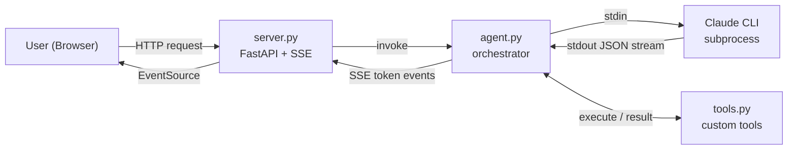

### Why a Middleman?

Claude alone cannot execute code, query databases, or call external APIs. The agent provides those capabilities as **tools**, turning Claude from a text generator into an autonomous problem solver that can gather information, reason about it, and deliver grounded answers.

---

## 2. How the Agent Launches Claude

### The Core Command

The agent spawns Claude CLI as a child process using Python's `subprocess.Popen`:

```python
proc = subprocess.Popen(
    ["claude", "-p", "--model", "opus", "--output-format", "stream-json",
     "--verbose", "--include-partial-messages", "--no-session-persistence"],
    stdin=subprocess.PIPE, stdout=subprocess.PIPE, stderr=subprocess.PIPE,
    text=True, bufsize=1,
)
```

### Flag Reference

| Flag | Purpose |
|------|---------|
| `-p` | **Pipe mode** -- disables interactive UI; reads from stdin, writes to stdout |
| `--model opus` | Selects the Opus model for highest capability |
| `--output-format stream-json` | Emits line-delimited JSON events for structured parsing |
| `--verbose` | Includes additional metadata (e.g., token usage) |
| `--include-partial-messages` | Emits every token as it is generated (enables typewriter effect) |
| `--no-session-persistence` | Stateless mode; no conversation history is saved to disk |

### The Three I/O Pipes

`subprocess.Popen` establishes three communication channels between the agent and Claude CLI:

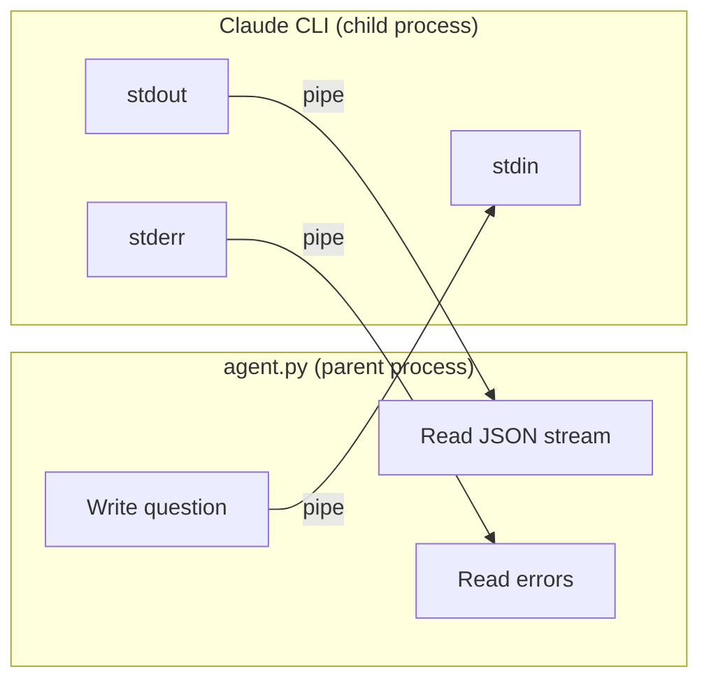

- **`text=True`** -- use text mode (UTF-8 strings, not raw bytes)
- **`bufsize=1`** -- line-buffered I/O (read/write one line at a time)

### Authentication

The command contains no API key or token. Claude CLI uses **local OAuth** -- the first time you run it, a browser window opens for Anthropic account login. Credentials are stored in `~/.claude/` and are never committed to the repository.

Anyone who clones the repo must install Claude CLI and authenticate with their own account.

### Tool Access in Pipe Mode

In pipe mode (`-p`), Claude's built-in tools (Read, Edit, Bash, etc.) are **disabled**. Claude can only use the custom tools we define in `tools.py`, which it invokes via `<tool_call>` XML tags in its text output.

---

## 3. Streaming Fundamentals

### The Problem with Non-Streaming Responses

Without streaming, the user submits a question and stares at a blank screen for several seconds until the complete response arrives in one shot. This creates a poor user experience, especially for long-form answers.

### How Streaming Works

With streaming, tokens are emitted as they are generated -- the familiar "typewriter effect":

```
Non-streaming:  Request --> wait 5s --> "The Dallas dealer received 3 cars, shipping $450"
Streaming:      Request --> 0.3s --> "The" --> "Dallas" --> "dealer" --> ... --> done
```

### Real-Time Communication Protocols

| Protocol | Direction | Analogy | Use Case |
|----------|-----------|---------|----------|
| HTTP request/response | One-shot | Text message | Standard API calls |
| **SSE (Server-Sent Events)** | Server to client (one-way) | Live broadcast | AI token streaming, push notifications |
| WebSocket | Bidirectional | Phone call | Chat rooms, collaborative editing, gaming |

This project uses **SSE** because we only need to push tokens from the server to the browser. The frontend connects with the browser's native `EventSource` API:

```javascript
const es = new EventSource("/api/agent-stream?message=...");
es.onmessage = function(event) {
    const data = JSON.parse(event.data);
    // Append each token to the UI as it arrives
};
```

Normal HTTP closes the connection after one response. SSE keeps it open, letting the server push events continuously until the response is complete.

---

## 4. Claude CLI's stream-json Output Format

### Without stream-json

Claude CLI outputs plain human-readable text to the terminal:

```
The Dallas dealer received 3 cars, shipping $450.
```

### With stream-json

The same content becomes line-delimited JSON events:

```json
{"type":"stream_event","event":{"type":"content_block_delta","delta":{"type":"text_delta","text":"The Dallas"}}}
{"type":"stream_event","event":{"type":"content_block_delta","delta":{"type":"text_delta","text":" dealer received"}}}
{"type":"stream_event","event":{"type":"content_block_delta","delta":{"type":"text_delta","text":" 3 cars, shipping $450."}}}
{"type":"result","result":"The Dallas dealer received 3 cars, shipping $450.","total_cost_usd":0.03}
```

The JSON wrapping is performed by the CLI, **not** by the Claude model. The model generates the same number of tokens regardless of the output format.

### Why stream-json Matters

Without structured events, you would need to read stdout character by character with no way to know:
- When the response is complete (no `result` event)
- How much the call cost (no `total_cost_usd`)
- Where one logical event ends and another begins

stream-json provides **structured event boundaries and metadata** -- the foundation for building a reliable SSE pipeline to the frontend.

---

## 5. The Streaming Event System

### Message Structure

A single Claude response (message) can contain **multiple content blocks**, similar to an email with paragraphs and attachments:

```
Message
+-- Content Block 0: text    "Let me query the data..."
+-- Content Block 1: tool_use query_data(code="df.head()")
+-- Content Block 2: text    "Based on the results..."
```

### Event Lifecycle

The stream emits six event types in a strict temporal order:

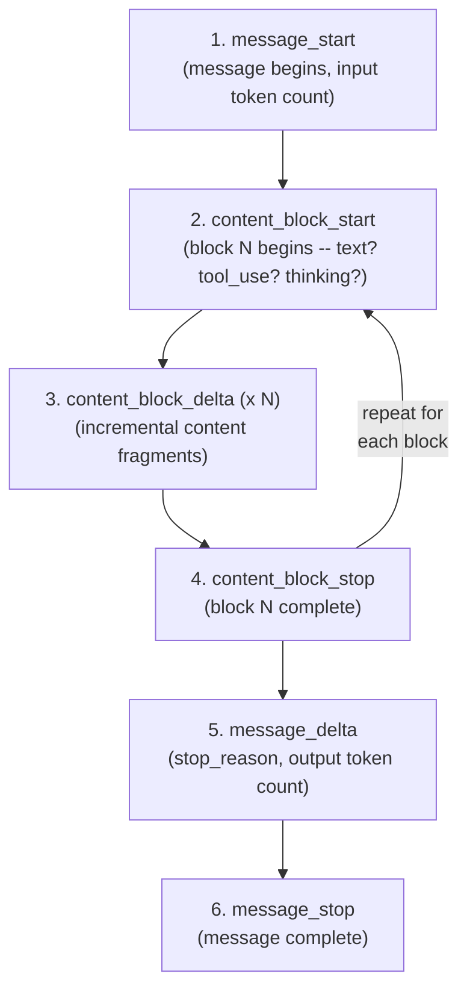

### Delta Subtypes

The `content_block_delta` event carries a `delta` object whose `type` field determines the content:

| delta.type | Content | When It Appears |
|------------|---------|-----------------|
| `text_delta` | A fragment of text | Claude is generating a text response |
| `input_json_delta` | A fragment of tool parameter JSON | Claude is invoking a tool (SDK native mode) |
| `thinking_delta` | A fragment of reasoning trace | Extended thinking is enabled |

### Nested Structure

These are nested, not alternatives. Our code unwraps them layer by layer:

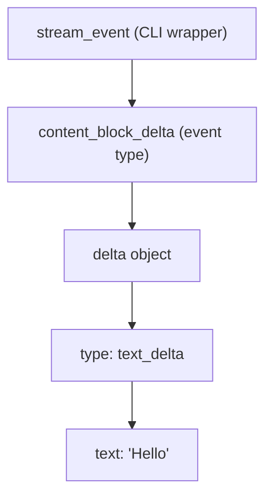

### Stop Reasons

The `message_delta` event includes a `stop_reason` that tells us why Claude stopped:

| stop_reason | Meaning |
|-------------|---------|
| `end_turn` | Claude finished its response naturally |
| `tool_use` | Claude wants to call a tool and is waiting for results |
| `max_tokens` | Response was truncated at the token limit |
| `stop_sequence` | A custom stop sequence was encountered |

---

## 6. The Two-Layer Parsing Pipeline

Raw CLI output is complex and verbose. We simplify it into three event types before passing upstream.

### Layer 1: `_call_claude_stream()` -- The Translation Layer

This generator function reads JSON lines from stdout and yields simplified events:

```python
while True:
    line = proc.stdout.readline()       # Blocking read, one line at a time
    if not line:
        break                           # Empty string = process ended

    event = json.loads(line)            # Parse JSON string to Python dict
    etype = event.get("type", "")

    if etype == "stream_event":
        inner = event.get("event", {})
        if inner.get("type") == "content_block_delta":
            delta = inner.get("delta", {})
            if delta.get("type") == "text_delta":
                text = delta.get("text", "")
                if text:
                    full_text += text
                    yield {"type": "token", "text": text}

    elif etype == "result":
        cost = event.get("total_cost_usd", 0.0)
        yield {"type": "done", "text": full_text, "cost": cost}
```

### Layer 2: `run_agent_stream()` -- The Orchestration Loop

Consumes simplified events and drives the tool-call loop:

```python
for event in _call_claude_stream(messages, system_prompt):
    if event["type"] == "token":
        text += event["text"]              # Concatenate + forward to SSE
    elif event["type"] == "done":
        total_cost += event.get("cost", 0.0)
    elif event["type"] == "error":
        stream_error = event["error"]
```

### Simplified Event Summary

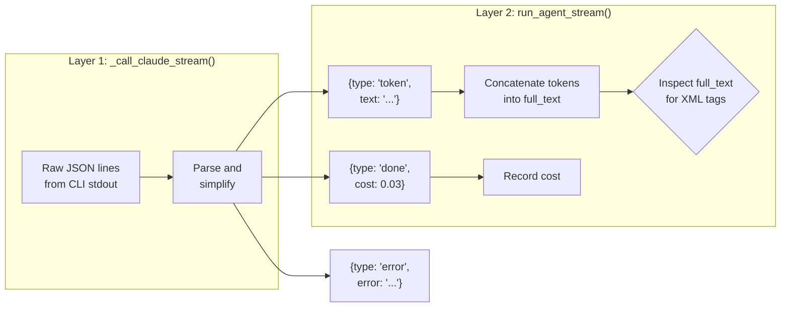

| Simplified Event | Source | Purpose |
|-----------------|--------|---------|
| `token` | `stream_event > content_block_delta > text_delta` | Forward text fragment to frontend |
| `done` | `result` event | Signal completion, record cost |
| `error` | CLI process failure | Surface error to caller |

---

## 7. The Tool-Call Loop

After Claude finishes streaming a response, the accumulated `full_text` falls into one of three categories:

### Case 1: `<answer>` Tag Present

Claude has enough information to answer directly:

```
<answer>3 cars were allocated to the Dallas dealer, shipping cost $450</answer>
```

The agent extracts the content with a regex and returns it to the user. **Loop ends.**

### Case 2: `<tool_call>` Tag Present

Claude needs external data:

```
<tool_call>{"name": "query_data", "args": {"code": "df.head()"}}</tool_call>
```

The agent parses the JSON, executes the tool, and feeds the result back:

```python
tool_call = _parse_tool_call(text)             # Regex extract + json.loads
tool_name = tool_call.get("name", "unknown")   # "query_data"
tool_args = tool_call.get("args", {})          # {"code": "df.head()"}

tool_result = run_tool(tool_name, tool_args)   # Execute in tools.py

messages.append({"role": "assistant", "content": text})
messages.append({"role": "tool_result", "content": result_str})
# Continue loop -- call Claude again with updated messages
```

### Case 3: Plain Text (No Tags)

Claude responded with unstructured text. Treat it as the final answer and return it.

### Complete Loop Flowchart

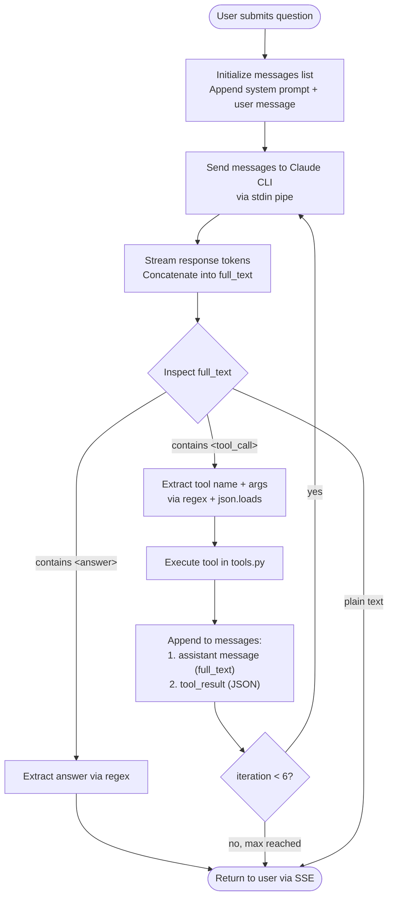

### Token Truncation Is Not an Issue

During streaming, `<tool_call>` arrives as fragments across many tokens:

```
token 1: "<tool"
token 2: "_call>"
token 3: "{\"name\":"
token 4: "\"query_data\""
...
token N: "</tool_call>"
```

This is harmless. The agent only concatenates text during streaming. Parsing happens **after the stream ends**, when `full_text` is guaranteed to be complete.

### Multi-Turn Example

```mermaid
sequenceDiagram
    participant U as User
    participant A as Agent
    participant C as Claude
    participant T as Tools

    U->>A: "How many cars went to Dallas?"
    A->>C: system prompt + user question

    Note over C: Round 1
    C-->>A: stream: "I need to query the data..."
    C-->>A: &lt;tool_call&gt;query_data(code="...")&lt;/tool_call&gt;
    A->>T: run_tool("query_data", {code: "..."})
    T-->>A: {"result": [{"vin":"V001","dealer":"Dallas"}, ...]}
    A->>A: Append assistant msg + tool result to messages

    Note over C: Round 2
    A->>C: system prompt + full history
    C-->>A: stream: "Let me also check the constraints..."
    C-->>A: &lt;tool_call&gt;list_constraints(...)&lt;/tool_call&gt;
    A->>T: run_tool("list_constraints", {...})
    T-->>A: {"constraints": [...]}
    A->>A: Append to messages

    Note over C: Round 3
    A->>C: system prompt + full history
    C-->>A: &lt;answer&gt;Dallas received 3 cars...&lt;/answer&gt;
    A->>U: Final answer delivered via SSE
```

---

## 8. Context Management

### The Stateless Challenge

Because we use `--no-session-persistence`, Claude has **no memory** between subprocess calls. Every invocation is a blank slate -- Claude does not know what happened in previous rounds.

### How the Agent Maintains State

The agent keeps a `messages` list in memory that accumulates the full conversation:

```python
# Initialization
messages = []
if history:                                         # Frontend chat history
    for h in history:
        messages.append({"role": h["role"], "content": h["content"]})
messages.append({"role": "user", "content": message})  # Current question

# After each tool round, append:
messages.append({"role": "assistant", "content": text})
messages.append({"role": "tool_result", "content": result_str})
```

### Building the Input Text

The `_build_input()` function serializes the entire messages list into a single plain-text string:

```python
def _build_input(messages, system_prompt):
    parts = [system_prompt, ""]
    for msg in messages:
        role = msg["role"]
        content = msg["content"]
        if role == "user":
            parts.append(f"Human: {content}")
        elif role == "assistant":
            parts.append(f"Assistant: {content}")
        elif role == "tool_result":
            parts.append(f"Human: Tool result:\n{content}")
    parts.append("Assistant:")
    return "\n\n".join(parts)
```

### The Token Cost Trade-Off

Every iteration resends the entire conversation history as plain text. Token usage grows linearly:

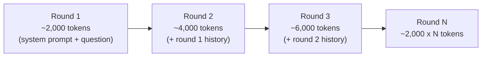

This is a structural limitation of the CLI subprocess approach. The SDK alternative (discussed in Section 10) avoids this duplication by sending only incremental messages.

---

## 9. How Claude Discovers Tools

### There Is No Magic

Claude does not have any built-in mechanism to "discover" tools at runtime. It simply reads a text description that we inject into the system prompt.

### Tool Specification

Each tool is defined as a Python dictionary in `tools.py`:

```python
QUERY_DATA_SPEC = {
    "name": "query_data",
    "description": "Execute a pandas expression against the loaded dataset...",
    "parameters": {
        "code": {
            "type": "string",
            "description": "Python/pandas code to execute.",
            "required": True,
        }
    },
}
```

### From Spec to Prompt

A helper function converts all specs into human-readable text:

```
### query_data
Execute a pandas expression against the loaded dataset...
Parameters:
    - code: string (required) -- Python/pandas code to execute.

### run_allocation
Run the optimizer with given parameters.
Parameters:
    - n_vehicles: integer (optional) -- Number of vehicles to allocate
    - beta: float (optional) -- Revenue weight, default 0.7
```

This text is inserted into the system prompt's `{tool_descriptions}` placeholder. Claude reads it, understands what tools are available, and responds with XML tags when it wants to invoke one.

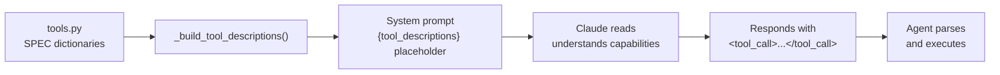

---

## 10. End-to-End Data Flow

The complete transformation chain from Claude's output back to Claude's input:

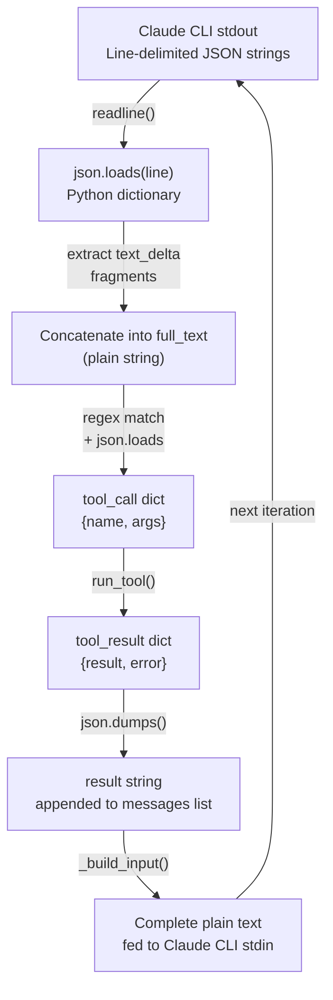

**The full chain:** JSON string from stdout --> Python dict (unpack text fragments) --> plain string (full response) --> Python dict (parse tool call) --> execute tool --> Python dict (tool result) --> JSON string --> append to messages --> concatenate into plain text --> feed back to Claude via stdin.

---

## 11. CLI vs SDK: Architecture Comparison

### Current Architecture (CLI + Text Parsing)

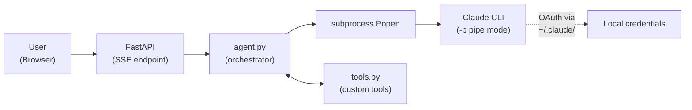

**Strengths:**
- No API key management; uses existing CLI login
- Simple implementation; easy to understand and debug
- Full control over custom tool definitions

**Weaknesses:**
- Every round resends the full conversation history (token waste)
- Tool calls parsed via regex on XML tags (fragile)
- Requires Claude CLI installed on the host machine

### SDK Migration Target

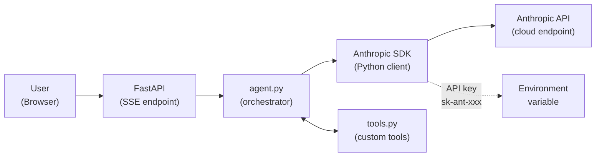

### Side-by-Side Comparison

| Dimension | CLI + Text Parsing | SDK Native Tools |
|-----------|-------------------|-----------------|
| **Tool discovery** | Text description in system prompt | Structured JSON Schema via `tools` parameter |
| **Tool invocation** | `<tool_call>` XML tags in text output | `tool_use` content block (structured) |
| **Parameter format** | Claude self-generates JSON string | API guarantees schema-valid JSON |
| **Reliability** | Regex parsing; Claude may malform JSON | Format guaranteed by API contract |
| **Parsing** | Manual regex extraction + json.loads | SDK returns Python objects directly |
| **Token efficiency** | Tool specs consume prompt tokens; full history resent each round | Dedicated tools field; incremental messages |
| **Authentication** | OAuth browser login | API key (`sk-ant-xxx`) |
| **Billing** | Subscription plan (Pro/Max) | Pay-per-token usage |
| **Deployment** | Requires CLI installed on host | pip install only |

### Migration Scope

The migration from CLI to SDK is targeted -- most of the codebase remains unchanged:

| Component | Changes Required |
|-----------|-----------------|
| `_call_claude_stream()` | Replace subprocess with `client.messages.stream()` |
| `_build_input()` | Replace plain-text concatenation with JSON message array |
| Tool SPEC dicts | Convert to `input_schema` (standard JSON Schema) format |
| Tool execution logic | No change |
| SSE push to frontend | No change |
| Frontend code | No change |

### Expected Gains

- **20--30% token cost reduction** -- no repeated history resend; tool specs in dedicated field
- **Guaranteed tool-call format** -- no more regex parsing failures or malformed JSON
- **Simpler deployment** -- no CLI installation dependency; just `pip install anthropic`
- **Incremental messages** -- send only new messages each round, not the full history

### Future: Agent SDK

Looking further ahead, the Claude Agent SDK wraps the entire tool loop automatically:

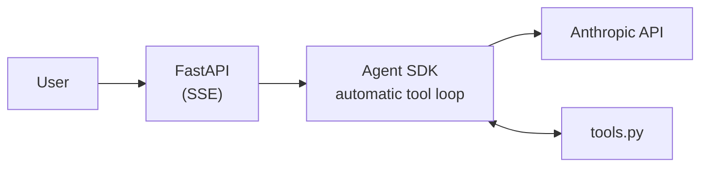

The Agent SDK eliminates the manual `while` loop, iteration guards, and tool-call parsing. However, it is still maturing. Migrating to the standard SDK first is the safer, more predictable intermediate step.

---

## Summary

This architecture demonstrates a practical pattern for building AI agents: use an LLM as the reasoning core, extend its capabilities with custom tools, and orchestrate the interaction through a streaming middleware layer. The CLI-based approach is simple and effective for prototyping, while a clear migration path to the SDK exists for production workloads that demand reliability and cost efficiency.
