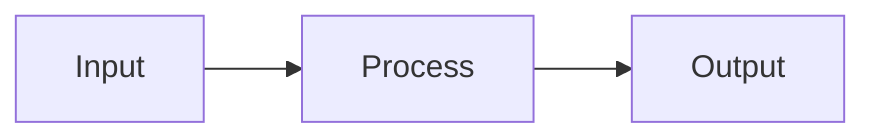

<!--
  PROJECT DETAIL TEMPLATE
  =======================

  How to use:
  1. Copy this file to content/projects/<slug>.md (slug must match the `id`
     field in src/data/projects.json).
  2. Optionally also create content/projects/<slug>.zh.md for the Chinese
     version. If absent, zh visitors fall back to the English body.
  3. Run `python3 scripts/generate_projects.py` to compile and register.
     The generator writes:
       . public/projects/<slug>/body.html        (compiled markdown)
       . public/projects/<slug>/body.zh.html     (if .zh.md exists)
       . projects/<slug>/index.html              (route shell)
       . vite.config.ts entry                    (rollup input)

  Authoring conventions (full spec: specs/001-personal-site/projects-detail.md)

  Voice and style:
    . Write in first person. The reader is a peer engineer who wants to know
      what I chose and why. Use "I built", "I chose", "the rule I landed on",
      "the tradeoff I accepted". Do not describe the project as if it were an
      external framework feature.
    . No em dashes anywhere (titles, summaries, body copy, captions). Use a
      period and new sentence, a colon, a comma, or parentheses.
    . No marketing hype, no self-justifying filler ("and it genuinely worked",
      "that's why I want to write about it"). Let the specifics speak.

  Structure:
    . One column, narrative-led. No body H1/H2 for the project name (the page
      title is rendered automatically from projects.json).
    . Open with a one-paragraph LEDE (about 120 to 180 words) stating intent
      and outcome.
    . Follow with a PROBLEM paragraph (about 80 to 120 words) framing what
      was missing or broken before.
    . Drop in 3 to 5 catalog artifacts (mermaid diagram, code block, terminal
      output, metric tile, screenshot). Each artifact is followed by a
      one-line italic caption in this format:

          *FIG.NN: short caption explaining what the reader is looking at.*

      The italic-on-its-own-line is styled as an uppercase mono caption.
      The separator after FIG.NN is a colon, not an em dash.
    . Close with one paragraph on OUTCOMES (concrete numbers if available)
      and what is next on the roadmap.

  Targets: 600 to 1000 words. 1 to 2 diagrams. 2 to 4 code blocks.
  Avoid full-bleed screenshots, fake browser chrome, marketing tone.
-->

REPLACE THIS WITH THE LEDE PARAGRAPH. State what I built and what it
unlocked. About 120 to 180 words. Treat the reader as a peer engineer; skip
the elevator pitch and go straight to the technical why.

REPLACE THIS WITH THE PROBLEM PARAGRAPH. What was missing or broken before
I built this. About 80 to 120 words. This frames every artifact that follows.



*FIG.01: Replace with a real architecture or flow diagram and a one-line caption.*

```typescript
// Replace with a real code snippet that shows a key implementation moment.
// Keep it short (10 to 25 lines). The caption below should explain why
// I chose this approach, not what the code does.
```

*FIG.02: Caption explaining the decision behind this snippet, not its mechanics.*

```bash
$ replace-this-with-a-real-command
output line
output line
```

*FIG.03: Terminal-style block for CLI output, build logs, or test results.*

REPLACE THIS WITH THE OUTCOME PARAGRAPH. Concrete numbers if any (stars,
installs, runtime improvements, dollars saved). What I would change if I
started over. What is next on the roadmap.
