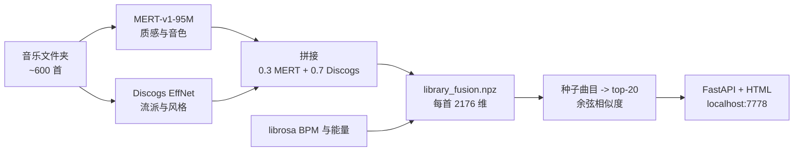

DJ Selector 背后的产品假设是：DJ 在现场真正的认知负载不是对拍（2010 年代以来打碟机自己就能干），而是「下一首是什么」。crate 里有一千首歌，舞池在读当下这一段 drop 的能量，DJ 大约九十秒内要决定下一首接什么。Rekordbox 和 Serato 会推「相关曲目」，但那些列表是元数据驱动的：同 key、同 BPM、同流派标签。两首 124 BPM 升 F 小调的 house 在听感上仍然可能打架，列表里也忽略掉了「下一首接得上」里那一半藏在质感和音色里的部分。DJ Selector 用一张声学相似度地图替代了元数据列表。我曲库里的每首歌变成 2176 维嵌入空间里的一个点，「下一首接什么」就变成「这颗种子的邻居有谁」。

元数据列表不够用的原因是：它跟声学契合度相关，但不等于声学契合度。一个真在打碟的 DJ 用手知道这件事，而且每个曲库都得自己学一遍：哪两个看起来不相干的艺术家其实叠得上，哪些曲目即便 BPM 差出 20% 也能当作过渡。把曲库建模成向量空间之所以有意思，是因为它直接捕捉「听起来像」这层关系，不需要任何流派标签。



*FIG.01：索引流水线。MERT 是一个深度音乐 transformer，捕捉质感和音色。Discogs EffNet 在一个大得多的、带流派标签的语料上训练，带来流派直觉。两者在 α=0.3 处融合，让流派那一半决定大致邻域，MERT 拉进次级的「这两首具体听起来很像」信号。*

融合权重是真正承重的决定。只用 MERT 会按情绪和乐器聚类，但流派盲到一种会害死 DJ 歌单的程度（它会推一首 beatless 的 ambient，因为它和种子的 pad 共享音色）。只用 Discogs 又过于流派死板（种子是 deep house 就只会出 deep house，哪怕下一个槽位想要一首跨出去的过渡曲）。把两个 L2 归一化的向量按 0.3 MERT、0.7 Discogs 拼起来，让 Discogs 决定大致邻域，MERT 在邻域内做精排。0.5 和 0.7 我都试过，都把流派边界冲得太散。

音乐上最有意思的决定是 BPM 容差。DJ 知道 70 BPM 和 140 BPM 不是对立面：half-time hip-hop 落在一首 house 每隔一拍上，数学上它们共享同一个网格。所以 BPM 过滤接受三个窗口：同 BPM（容差内）、严格 half-time、严格 double-time。容差 6%，一颗 124 BPM 的种子能够到 117–131 的 house、234–262 的 drum-and-bass（double-time）、58–66 的 hip-hop（half-time）。就这一条规则，把工具从「声学相似度引擎」变成了「真的能用的 DJ 工具」。

```text
seed: 124 BPM
  接受窗口（6% 容差）：
    direct:      117 - 131 BPM
    half-time:    58 -  66 BPM   （种子节拍的两倍速）
    double-time: 234 - 262 BPM   （种子节拍的一半速）
```

*FIG.02：一颗 124 BPM 种子的 BPM 接受窗口。half-time 和 double-time 这两个窗口的存在，是为什么 92 BPM 的 hip-hop 和 184 BPM 的 footwork 能相对同一颗种子被正确处理，而不是被当成「太远」过滤掉。*

能量是第二条轴。嵌入给我声学相似度。我希望能沿着一条刻意的能量曲线推动舞池（暖场、铺垫、高潮、降温）。打分函数是 `cosine(emb, seed) - 0.2 × |energy - seed_energy|`。0.2 这个权重小到嵌入仍然主导排序，但大到在两首相似度相当的曲目之间，更靠近当下舞池能量的那首会赢。DJ 可以把排序切成「能量升序」在收尾段刻意往下滑，或者切成「BPM 升序」给后面一小时铺一段速度爬升。

让这件事真的能当工具用的是交互闭环。挑一颗种子，拿 20 个邻居，挑一首播，按「排除」让它再也不冒上来，那首就成了下一颗种子，循环。一个 60 首的 set 用这种方式点五分钟左右就好了，过去要在 crate 里翻一小时；嵌入抓得到那些元数据列表抓不到的声学邻接。还有一个去重模式（在曲库里找近重复，因为同一首歌从不同源 rip 来文件名经常微差）、一个手工整理的 Rekordbox crate 导入路径、还有一个网易云音乐加密格式的转换器，让我能把那批曲目并进同一个曲库。

聚类训练（在四个手工整理的 Rekordbox crate 上跑 triplet loss 加一个 2048→128 投影头：Balie、HOUSE2、Hyperpop，再加一个从最近常听里切出来的）是一个计划中的升级，目的是从我已经存下的歌单里学到一个属于我个人的「接得上」函数。无监督融合目前已经够用，所以这步还没动。一切跑在一台机器的本地磁盘上。不上传、没 API、没分析：音乐文件是已授权的，嵌入库是我的。

「工具能用」这件事的定性论据站得住：挑一颗种子，五分钟搭出一个 60 首的 set，嵌入抓得到那些元数据列表抓不到的声学邻接。要不要用四个手工 crate 训出来的投影头打过裸融合，留给下一轮 held-out 实验回答。
