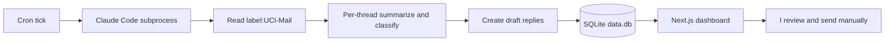

<!-- ROUGH FIRST PASS. Sourced from EmailDigest/CLAUDE.md and README. Replace
     [VERIFY: ...] markers in the next deep-dive pass. -->

I built EmailDigest because UCI sends me a few hundred labeled `UCI-Mail` threads a week and the only thing I needed from most of them was a one-line "is this worth opening." The piece that made it tractable was that Claude Code already runs as a subprocess on my machine, so I did not need a server, an API quota, or a queue. A cron job invokes Claude with a system prompt, the prompt reads Gmail through the standard Gmail tool surface, and the output lands in a SQLite file that a Next.js dashboard reads.

The problem with the off-the-shelf options is that they all want to ingest the inbox into a third-party SaaS. For school mail that is the wrong answer. The compromise I landed on was the smallest possible architecture that still feels reliable: cron triggers Claude as a subprocess; Claude operates on a strict label scope (`label:UCI-Mail` only) so it cannot wander into personal mail; every action is bounded to draft creation only, never send, never delete. The dashboard is read-only over the SQLite file.



*FIG.01: data path from cron to draft. Nothing in the loop sends mail; sending is always a manual click.*

The two-channel deploy was the part that took me the longest to get right. I run a TEST instance locally on `email.cmyao.com` and a PROD instance on an EC2 box at `email1.cmyao.com`. They share one git repository but each has its own `.env.local` with its own auth token, so a leak on one channel does not compromise the other. The repo is private to keep historical token churn off public history. The deploy is wired through GitHub Actions on push to `master`: SSH to the EC2 box, `git pull`, `npm ci`, `npm run build`, restart via `systemctl`, smoke-test. Database changes do not flow through CI on purpose because the local SQLite file holds state I do not want to overwrite from the runner.

```bash
# ~/.local/bin/emaildigest-tick (simplified)
cd /Users/cm/Downloads/EmailDigest
exec claude --no-tty \
  --system "$PROMPT_DIR/system.md" \
  --tool gmail \
  --tool sqlite \
  --max-turns 12 \
  < /dev/null >> logs/$(date +%F).log 2>&1
```

*FIG.02: simplified cron entry point. The real wrapper handles env loading and lock-file coordination.*

The hard rule the system enforces is the one I cannot trust myself to remember at 2 a.m.: AI Generate runs in a read-only mode that strips access to `gmail_create_draft` so a generation session cannot accidentally create real drafts. Drafting is gated to the explicit triage cron, never to ad-hoc generation runs. I picked the rule because I once let a draft be created against the wrong account during testing and I did not want a second incident of that kind.

`[VERIFY: how many threads per week the system actually processes once steady-state]`. `[VERIFY: average latency per tick and the cost per tick in API tokens]`. `[VERIFY: how often I edit drafts versus accept them as-is]`. `[VERIFY: the smoke-test contract the GitHub Actions deploy uses to decide pass or fail]`. `[VERIFY: how token rotation works in practice when both channels are live]`.

The piece that surprised me is how much of the design ended up being about deployment ergonomics rather than the LLM. The model side is small. The interesting part was carving the trust boundary so that local development, EC2 production, GitHub history, and ambient Claude sessions all stay isolated.
