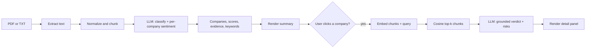

I built Finance Analyzer in two passes. The first pass was a Next.js App Router app that I ran locally to validate the analysis pipeline: classify a finance document, extract the companies it names, score per-company sentiment, then answer per-company drilldown questions on demand via RAG. Once that worked end-to-end I ported it to my personal site as a fully browser-side static page at `/tools/finance-analyzer/`. The algorithm is the same in both. The trust boundary moved.

The local prototype was the right shape for iteration. Server-side OpenAI calls (so I could keep the key in `OPENAI_API_KEY` and use real models without auth ceremony), `pdf-parse` for extraction, `zod` for response validation, `vitest` for the parts that did not need OpenAI, and route handlers under `app/api/analyze` and `app/api/company-analysis` so the client could keep the analyzed text in memory between the initial pass and the company drilldown. Stateless on the server, no database. The README I wrote during that phase pinned the model defaults at `gpt-4.1-mini` for analysis and `text-embedding-3-small` for embeddings, both overridable via env.



*FIG.01: same pipeline both versions run. Drilldown is on demand because embeddings cost money and most documents do not get every company drilled.*

The piece I designed before writing any LLM call was the document-level prompt. Classify into `financial_report`, `news`, or `discussion`. Extract only companies the text actually names. Score sentiment **per company**, not the document overall, because an earnings article that praises one firm and pans another should produce two opposite scores. Return JSON only, with `evidenceSnippets` short and verbatim. The system prompt enforces all of that:

```typescript
{
  role: "system",
  content:
    "You are a finance document analyst. Return JSON only. Classify the uploaded text as financial_report, news, or discussion. Extract only companies explicitly mentioned. For each company, assign a company-specific sentiment label and score from -1 to 1 based on what the text says about that specific firm, not the overall article. Keep evidence snippets short and verbatim. Keep keywords concise.",
}
```

*FIG.02: system prompt verbatim from `lib/openai/client.ts`. The "specific firm, not the overall article" line is the one that broke the early version.*

The chunker is the only place I let myself iterate on the algorithm itself. It splits on paragraph boundaries first, then falls back to character slicing for paragraphs that exceed `maxChars`. The defaults I shipped are 1600 chars per chunk with 220 char overlap, both overridable. The unit tests in `chunking.ts` cover the paragraph-respect case and the long-paragraph fallback case so I did not have to think about the boundaries again.

```typescript
export function chunkText(text: string, options: ChunkOptions = {}): Chunk[] {
  const maxChars = options.maxChars ?? 1600;
  const overlapChars = options.overlapChars ?? 220;
  const normalized = normalizeText(text);
  if (!normalized) return [];
  const paragraphs = normalized.split(/\n\n+/);
  // ...accumulate paragraphs into a buffer, flush when adding the next one
  // would exceed maxChars; carry an overlap window into the next chunk.
}
```

*FIG.03: the chunker contract. Test coverage in `chunking.test.ts` is what made me trust the parameter defaults.*

Porting to the personal site was a deliberate downgrade in some directions and an upgrade in others. The site is a static MPA on Vercel with no server runtime next to it, so a Next.js API route would mean either a second deployment or paying for everyone's OpenAI usage. Neither matched the goal of a public portfolio tool. The port pushed three things into the browser: PDF extraction (swapped `pdf-parse` for `pdfjs-dist` with a worker), the OpenAI client (now talks to OpenAI directly from the page), and the API key (held in `sessionStorage`, cleared on tab close). The `zod` schemas became hand-written type guards because the static page does not bundle a validator. The route handlers became two function calls in a single TS entry mounted at `/tools/finance-analyzer/`.

What did not change is the algorithm: the document-level prompt, the per-company sentiment shape, the on-demand drilldown via embeddings + cosine top-k, the keyword extraction with a stop-word filter. The browser version uses the same chunk parameters (1600 / 220) so analysis on the same PDF produces the same chunks regardless of which version processed it.

`[VERIFY: drift between local Next.js output and browser-port output on the same fixture, if any]`. `[VERIFY: how long the per-company drilldown takes on a typical 10-page transcript in the browser]`. `[VERIFY: real OpenAI cost per analyze + drill round when the user supplies their own key]`. The architecture is grounded in the real source on both sides; the numbers I will fill in once I have a stable sample.
