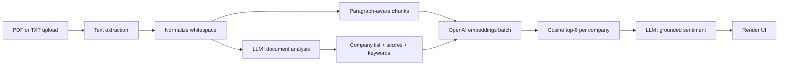

I built Finance Analyzer because every "AI for finance documents" demo I tried wanted me to upload a PDF to someone else's server. For an earnings call transcript that is fine. For an internal memo or a draft 10-Q, it is not. The premise I started from was simpler: do everything in the browser, only outbound call is to OpenAI, and the user's API key never leaves their tab. The result is a single static page at `/tools/finance-analyzer/` that ingests a PDF or TXT, scores sentiment per company mentioned, and supports follow-up RAG questions on the same document, without a backend.

The problem with the existing tooling is that backend ingestion forces a trust boundary the user did not ask for. Once a document hits a server, the user has to take on faith what is logged, what is cached, and how long the file lives. I wanted a version where there is no such question because there is no server. The constraint that produced was: every step that touches the document has to run in the browser, and any step that talks to a model has to be a single explicit fetch the user can see in DevTools.



*FIG.01: end-to-end pipeline. Every box runs in the browser tab; only the two LLM boxes hit OpenAI.*

PDFs go through `pdfjs-dist` with the worker pinned in `extract-text.ts`; TXT files use `file.text()` directly. After extraction the text passes through `normalize.ts` (strip nulls, collapse whitespace, normalize CRLF), then splits two ways. One copy goes to the document-level LLM call that returns a structured analysis: companies named, their sentiment scores, top keywords, and short summary. The other copy goes through the chunker.

The chunker is the part I spent the most time tuning. The naive version just splits on character count. That breaks sentences mid-word and produces chunks that the embedding model can rank but the human cannot read. The version I shipped respects paragraph boundaries first, falls back to sentences, and only splits inside a sentence as a last resort:

```typescript
export function chunkText(text: string, maxChars = 1600, overlap = 220): Chunk[] {
  const paragraphs = text.split(/\n{2,}/).map((p) => p.trim()).filter(Boolean);
  const chunks: Chunk[] = [];
  let buffer = '';
  for (const para of paragraphs) {
    if ((buffer + '\n\n' + para).length > maxChars && buffer) {
      chunks.push({ id: chunks.length, text: buffer.trim() });
      buffer = buffer.slice(-overlap) + '\n\n' + para;
    } else {
      buffer = buffer ? buffer + '\n\n' + para : para;
    }
  }
  if (buffer.trim()) chunks.push({ id: chunks.length, text: buffer.trim() });
  return chunks;
}
```

*FIG.02: paragraph-aware chunker, 1600 char max with 220 char overlap.*

For RAG I batch the chunk embeddings and the per-company queries in one OpenAI call, then rank with cosine similarity inside the browser. Top 6 chunks per company get passed back to the model as grounded context for a second pass that produces the final per-company sentiment, with verdict, opportunities, and risks. That second pass is where the value lives because it is the only output the user can defend with citations from the document itself.

The fallback chain matters because the cheapest failure mode is an embedding 429 in the middle of a session. If embeddings fail I keep the document-level scores rather than crash. If a per-company LLM call fails I drop to a keyword heuristic that scans the chunks for `beat`, `growth`, `decline`, `risk` and produces a deterministic but blunt signal. Either fallback is clearly marked in the UI so the user knows the answer came from the LLM or from the heuristic.

The API key stays in `sessionStorage`. That is the strongest browser primitive that survives a soft refresh but dies on tab close, which matches the threat model: the user is willing to type the key once per working session and is not willing to leave it in `localStorage` for any extension to read later.

`[VERIFY: typical document size and chunk count distribution from real usage]`. `[VERIFY: latency breakdown between extraction, embedding, and per-company LLM passes]`. `[VERIFY: any accuracy comparison against a labeled set or human review]`. The deterministic parts are easy to defend. The numbers are what I will fill in once I have a stable sample of real uploads.
