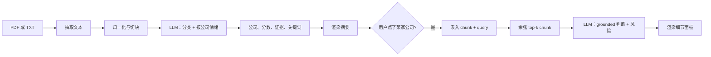

Finance Analyzer 我做了两遍。第一遍是一个 Next.js App Router 应用，跑在本地用来验证分析流水线：对一份金融文档做分类、抽出里面提到的公司、按公司打情绪分、然后通过 RAG 按需回答按公司的下钻问题。端到端跑通之后，我把它移植到个人站，作为一个完全跑在浏览器里的静态页面挂在 `/tools/finance-analyzer/`。两版算法一样，信任边界搬了家。

本地原型在迭代阶段是对的形态。服务端调用 OpenAI（这样 `OPENAI_API_KEY` 留在服务器上，不用搞鉴权礼仪也能用真模型），用 `pdf-parse` 做抽取，用 `zod` 做返回值校验，不依赖 OpenAI 的部分用 `vitest` 覆盖，路由处理函数挂在 `app/api/analyze` 和 `app/api/company-analysis` 下，让客户端能在初次分析和按公司下钻之间把分析过的文本留在内存里。服务端无状态，没有数据库。我那阶段写的 README 把模型默认值钉在 `gpt-4.1-mini` 做分析、`text-embedding-3-small` 做嵌入，都可以通过 env 覆盖。



*FIG.01：两版跑的是同一条流水线。下钻是按需触发的，因为嵌入要花钱，大多数文档里也并不是每家公司都会被钻一次。*

在写任何一行 LLM 调用之前我先设计的是文档级 prompt。把文档分成 `financial_report`、`news`、`discussion` 三类。只抽出文本里真正提到的公司。情绪分**按公司打**，不是按整篇文档打，因为一篇财报新闻里夸一家、贬一家，应该出两个相反的分数。只返回 JSON，`evidenceSnippets` 要短、要逐字。系统 prompt 把这些都写死了：

```typescript
{
  role: "system",
  content:
    "You are a finance document analyst. Return JSON only. Classify the uploaded text as financial_report, news, or discussion. Extract only companies explicitly mentioned. For each company, assign a company-specific sentiment label and score from -1 to 1 based on what the text says about that specific firm, not the overall article. Keep evidence snippets short and verbatim. Keep keywords concise.",
}
```

*FIG.02：从 `lib/openai/client.ts` 原样拿出来的系统 prompt。"specific firm, not the overall article" 这一行，是把早期版本掰回来的关键。*

切块器是我唯一允许自己在算法本身上反复调的地方。它先按段落切，遇到超过 `maxChars` 的段落再退化成字符切。出货默认值是每块 1600 字符、220 字符 overlap，都可以覆盖。`chunking.ts` 的单测覆盖了「尊重段落边界」和「长段落退化」两种情况，让我以后不用再回头想边界条件。

```typescript
export function chunkText(text: string, options: ChunkOptions = {}): Chunk[] {
  const maxChars = options.maxChars ?? 1600;
  const overlapChars = options.overlapChars ?? 220;
  const normalized = normalizeText(text);
  if (!normalized) return [];
  const paragraphs = normalized.split(/\n\n+/);
  // ...accumulate paragraphs into a buffer, flush when adding the next one
  // would exceed maxChars; carry an overlap window into the next chunk.
}
```

*FIG.03：切块器契约。`chunking.test.ts` 里的覆盖率，是让我相信默认参数的依据。*

移植到个人站，几个方向是降级、几个方向是升级，都是刻意的。这个站是一个挂在 Vercel 上的静态 MPA，旁边没有服务端运行时。一个 Next.js API 路由意味着要么单独再部一份后端、要么我自己付所有人的 OpenAI 账单，两者都不符合「公开作品集工具」这个目标。所以移植把三件事推进了浏览器：PDF 抽取（把 `pdf-parse` 换成 `pdfjs-dist` 加 worker）、OpenAI 客户端（现在直接从页面跟 OpenAI 通信）、API key（存在 `sessionStorage` 里，关 tab 就清）。`zod` schema 变成手写的类型守卫，因为静态页里不打包校验器。两个路由处理函数变成一个 TS 入口里的两次函数调用，挂在 `/tools/finance-analyzer/`。

没动的部分是算法：文档级 prompt、按公司情绪的形状、按需通过嵌入加余弦 top-k 做下钻、带停用词过滤的关键词抽取。浏览器版用同一组切块参数（1600 / 220），所以同一份 PDF 在两版上分块结果一致。

`[VERIFY: 同一份 fixture 在本地 Next.js 输出和浏览器移植输出之间的偏差（如有）]`。`[VERIFY: 浏览器里对一份典型十页转录稿做按公司下钻的耗时]`。`[VERIFY: 用户自带 key 时，一次 analyze + drill 在 OpenAI 那边的真实成本]`。两边架构都基于真实代码，等我有一份稳定样本再把数字填上。
