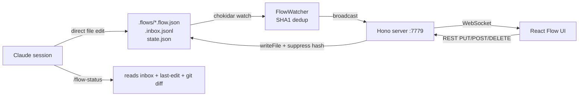

Every project's interaction logic lives in four places: a `PLAN.md`, a few `docs/` spec files, the code, and my head. Claude touches one, the other three start to drift. flow-canvas starts from accepting that node canvases are a real intermediate format, the kind that lets a human and Claude edit the same source of truth, and that the source of truth has to be JSON, not a binary visual file.

Push on that constraint and every design decision falls out. **JSON files**: Claude edits text natively. **`SCHEMA.md`, deliberately not named `CLAUDE.md` or `AGENTS.md`**: those names get auto-loaded by agent tools, which would inject about 150 lines of schema noise into the main context every time the agent touched anything in `.flows/`; SCHEMA.md only enters context when a slash command references it explicitly. **A `refs` field on every node**: the flow is a structured mirror of existing project docs, not a parallel source of truth, so each node carries `refs: ["docs/architecture.md#alarm"]` pointing back to the doc it came from. **An inbox pattern**: UI ↔ files is real-time bidirectional via chokidar plus WebSocket, but UI ↔ Claude session is not; clicking "notify Claude" in the UI appends a line to `.inbox.jsonl`, and the next `/flow-status` lets Claude pull it.

<div class="fc-mock fc-mock--canvas-wrap" aria-label="flow-canvas overview canvas mockup">
  <div class="fc-mock__head">
    <div class="fc-mock__crumbs">
      <span class="fc-mock__crumb">your-app</span>
      <span class="fc-mock__crumb-sep">/</span>
      <span class="fc-mock__crumb">.flows</span>
      <span class="fc-mock__crumb-sep">/</span>
      <span class="fc-mock__crumb fc-mock__crumb--last">overview</span>
    </div>
    <span class="fc-mock__head-meta">5 nodes · 6 edges</span>
  </div>
  <div class="fc-mock__canvas">
    <svg class="fc-mock__edges" viewBox="0 0 600 280" preserveAspectRatio="none">
      <defs>
        <marker id="fc-arrow" viewBox="0 0 10 10" refX="8" refY="5" markerWidth="6" markerHeight="6" orient="auto">
          <path d="M0,0 L10,5 L0,10 z" />
        </marker>
      </defs>
      <path d="M 145 96 C 200 70, 200 70, 252 56" marker-end="url(#fc-arrow)" />
      <path d="M 145 110 C 200 150, 200 170, 252 184" marker-end="url(#fc-arrow)" />
      <path d="M 358 56 C 380 90, 380 130, 358 184" marker-end="url(#fc-arrow)" />
      <path d="M 358 184 C 410 170, 430 140, 458 110" marker-end="url(#fc-arrow)" />
      <path d="M 358 198 C 410 220, 430 220, 458 224" marker-end="url(#fc-arrow)" />
      <path class="dashed" d="M 458 130 C 405 200, 380 215, 360 200" marker-end="url(#fc-arrow)" />
    </svg>
    <div class="fc-mock__node fc-mock__node--input" style="left:20px;top:88px;">
      <span class="fc-mock__node-type">user_input</span>
      User enters app
    </div>
    <div class="fc-mock__node fc-mock__node--logic" style="left:252px;top:36px;">
      <span class="fc-mock__node-type">logic</span>
      Onboarding (first run)
    </div>
    <div class="fc-mock__node fc-mock__node--state" style="left:252px;top:170px;">
      <span class="fc-mock__node-type">state</span>
      Home
    </div>
    <div class="fc-mock__node fc-mock__node--action fc-mock__node--has-subflow" style="left:458px;top:88px;">
      <span class="fc-mock__node-type">action</span>
      Alarm feature
    </div>
    <div class="fc-mock__node fc-mock__node--action" style="left:458px;top:210px;">
      <span class="fc-mock__node-type">action</span>
      Settings
    </div>
  </div>
</div>

*FIG.01: a small overview flow rendered on the canvas. The five node types (`user_input`, `logic`, `state`, `action`, `decision`) each get a left border colour. The arrow marked with `↓` carries a `subflow` reference, double-click drills into `alarm.flow.json`. The dashed back-edge is `style: "back"`, used for cancel or return-to-previous transitions.*



*FIG.02: file ↔ UI is real-time bidirectional; Claude session ↔ files is asynchronous and Claude pulls. chokidar watches the `.flows/` directory; the server hashes its own pending writes into a suppress table so its own change events are silenced.*

The file ↔ UI loop looks basic. Getting it right takes a few details. chokidar runs with `awaitWriteFinish: { stabilityThreshold: 80, pollInterval: 30 }` so external editor writes only fire after they settle. Before the server writes a file in response to a UI save, it pre-hashes the about-to-be-written content into the watcher's suppress table; when the watcher fires its own resulting change event the hash matches, the event is dropped, and the UI never sees its own write echoed back. Claude editing the file directly bypasses that path, and the watcher treats it as a normal external change.

```typescript
// server/index.ts (UI write path)
const json = JSON.stringify(parsed.data, null, 2) + '\n';
watcher.suppress(filePath, json);  // hash first, drop the echo
await fs.writeFile(filePath, json, 'utf8');
await recordLastEdit(name + FLOW_SUFFIX, 'ui-save', summary);
```

*FIG.03: the suppress call on the UI write path. The watcher's lastHash table already knows the file is about to take this hash, so the change event it triggers itself is silently skipped. Standard "my own write does not trigger my own event" pattern in single-process file watchers.*

Naming the schema doc `SCHEMA.md` instead of `CLAUDE.md` is the most counterintuitive decision in this project. Claude Code, Codex, and similar agent tools automatically pull `CLAUDE.md` and `AGENTS.md` files into the agent's context. If the schema doc used either name, the main session would get about 150 lines of schema noise injected every time it touched anything under `.flows/`. The trick is to name it `SCHEMA.md` and add one line to the project's main `CLAUDE.md`: "before editing `.flows/*.flow.json`, read `.flows/SCHEMA.md`". Slash commands also reference it explicitly. Claude knows the schema doc exists but only opens it when actually editing flows.

The `refs` field is the main anti-drift mechanism. Each node carries paths relative to the project root, with optional anchors: `docs/architecture.md#alarm-section`, `PHASE1.md#picker-design`. The first rule in `SCHEMA.md` says: read the existing project docs before touching flows. The flow is not a new write of the interaction logic; it is a structured view stitched out of existing docs, with each node pointing back to its source. The UI inspector lists `refs` as clickable paths. When a node's `notes` and the doc its `refs` points to disagree, the rule is to flag it and ask which side is the new truth.

<div class="fc-mock fc-mock--inspector" aria-label="flow-canvas node inspector mockup">
  <div class="fc-mock__inspect-head">
    <span>Inspector</span>
    <span class="fc-mock__inspect-name">Alarm feature · action</span>
  </div>
  <dl class="fc-mock__inspect-grid">
    <dt>id</dt>
    <dd><code>n_alarm</code></dd>
    <dt>label</dt>
    <dd>Alarm feature</dd>
    <dt>subflow</dt>
    <dd><code>alarm.flow.json</code> ↓</dd>
    <dt>notes</dt>
    <dd>Enter the alarm management page. Detailed flow lives in <code>alarm.flow.json</code>.</dd>
    <dt>refs</dt>
    <dd>
      <ul class="fc-mock__refs">
        <li>docs/architecture.md#alarm</li>
        <li>PHASE1.md#picker-design</li>
      </ul>
    </dd>
    <dt>tags</dt>
    <dd><code>feature</code></dd>
  </dl>
  <div class="fc-mock__inbox">
    <span><b>Notify Claude</b> queues a `.inbox.jsonl` line</span>
    <span>Last saved 14s ago by UI</span>
  </div>
</div>

*FIG.04: the inspector for a single node. `refs` is the load-bearing field: every entry points back to the doc the node was synthesised from. When the inspector shows a node whose `notes` no longer matches what the linked doc says, that mismatch is the artefact `/flow-status` is meant to surface.*

The inbox pattern handles the UI ↔ Claude gap. Each node in the UI has a "notify Claude" button. Clicking it appends a JSON line to `.flows/.inbox.jsonl` and copies a `/flow-status` snippet plus the user comment to the clipboard. The server also maintains `.last-edit.json`, which it overwrites on every UI save / create / delete / notify. When I switch to a terminal and run `/flow-status`, Claude reads the inbox first (the user's active intent matters more than diffs), then `last-edit.json`, then `git diff .flows/`, and finally clears the inbox so processed entries do not repeat. The whole loop converges UI and Claude session asynchronously without giving Claude a live WebSocket.

The stack is Hono plus chokidar plus xyflow/React Flow plus Zod plus Tailwind plus commander, all permissive licenses. After `npm link`, any project gets it via `flow-canvas init` followed by `flow-canvas serve`. `[VERIFY: number of projects this has been used in]`. `[VERIFY: which project actually exercised the inbox loop end to end]`. Known gaps: no cross-session undo (git is the backup), no auto-layout (positions are absolute coordinates), no multi-user merge (this is a single-machine tool). Stately assumes XState, n8n is an execution platform, tldraw makes you write 80% yourself; flow-canvas's compromise is to keep JSON as the intermediate format that humans and Claude both edit, let React Flow render the canvas, and write the project / Claude / multi-file glue myself.
