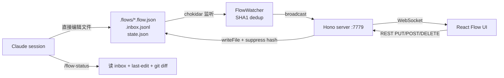

每个项目的交互逻辑都被写在四个地方：`PLAN.md` 里、`docs/` 散落的几篇 spec 里、代码里、还有我脑子里。Claude 改其中一份，其他三份就开始漂。我做 flow-canvas 的起点是承认：节点画布是一种正经的中间格式，可以让人和 Claude 同时编辑同一份真相，而真相必须是 JSON、不能是二进制图。

把这条约束推开，几乎所有设计决定都自动落地。**JSON 文件**：Claude 原生会改文本。**`SCHEMA.md`，故意不命名 `CLAUDE.md` 或 `AGENTS.md`**：那两个名字会被 agent 工具自动加载，每次碰到 `.flows/` 下任何文件都注入大约 150 行 schema noise；`SCHEMA.md` 的名字让它只在 slash command 显式引用时才进 context。**每个节点带 `refs` 字段**：flow 是项目已有 docs 的结构化镜像、不是平行的另一份真相，每个节点用 `refs: ["docs/architecture.md#alarm"]` 指回原文档。**Inbox 模式**：UI 和文件之间是实时双向（chokidar 加 WebSocket），但 UI 和 Claude session 之间不是；UI 上点「通知 Claude」就往 `.inbox.jsonl` 追一行，下次 `/flow-status` 让 Claude 自己来读。

<div class="fc-mock fc-mock--canvas-wrap" aria-label="flow-canvas overview 画布 mockup">
  <div class="fc-mock__head">
    <div class="fc-mock__crumbs">
      <span class="fc-mock__crumb">your-app</span>
      <span class="fc-mock__crumb-sep">/</span>
      <span class="fc-mock__crumb">.flows</span>
      <span class="fc-mock__crumb-sep">/</span>
      <span class="fc-mock__crumb fc-mock__crumb--last">overview</span>
    </div>
    <span class="fc-mock__head-meta">5 nodes · 6 edges</span>
  </div>
  <div class="fc-mock__canvas">
    <svg class="fc-mock__edges" viewBox="0 0 600 280" preserveAspectRatio="none">
      <defs>
        <marker id="fc-arrow-zh" viewBox="0 0 10 10" refX="8" refY="5" markerWidth="6" markerHeight="6" orient="auto">
          <path d="M0,0 L10,5 L0,10 z" />
        </marker>
      </defs>
      <path d="M 145 96 C 200 70, 200 70, 252 56" marker-end="url(#fc-arrow-zh)" />
      <path d="M 145 110 C 200 150, 200 170, 252 184" marker-end="url(#fc-arrow-zh)" />
      <path d="M 358 56 C 380 90, 380 130, 358 184" marker-end="url(#fc-arrow-zh)" />
      <path d="M 358 184 C 410 170, 430 140, 458 110" marker-end="url(#fc-arrow-zh)" />
      <path d="M 358 198 C 410 220, 430 220, 458 224" marker-end="url(#fc-arrow-zh)" />
      <path class="dashed" d="M 458 130 C 405 200, 380 215, 360 200" marker-end="url(#fc-arrow-zh)" />
    </svg>
    <div class="fc-mock__node fc-mock__node--input" style="left:20px;top:88px;">
      <span class="fc-mock__node-type">user_input</span>
      用户进入应用
    </div>
    <div class="fc-mock__node fc-mock__node--logic" style="left:252px;top:36px;">
      <span class="fc-mock__node-type">logic</span>
      Onboarding（首次）
    </div>
    <div class="fc-mock__node fc-mock__node--state" style="left:252px;top:170px;">
      <span class="fc-mock__node-type">state</span>
      主页
    </div>
    <div class="fc-mock__node fc-mock__node--action fc-mock__node--has-subflow" style="left:458px;top:88px;">
      <span class="fc-mock__node-type">action</span>
      闹钟功能
    </div>
    <div class="fc-mock__node fc-mock__node--action" style="left:458px;top:210px;">
      <span class="fc-mock__node-type">action</span>
      设置
    </div>
  </div>
</div>

*FIG.01：一份 overview 画布。五种节点类型（`user_input`、`logic`、`state`、`action`、`decision`）各自有独立的左边色条。带 `↓` 的节点挂着 `subflow`，双击可以钻进 `alarm.flow.json`。底部那条虚线是 `style: "back"`，给取消、回退、回到上一步用的回边。*



*FIG.02：双向同步是文件 ↔ UI 实时；Claude session ↔ 文件是异步、Claude 主动拉。chokidar 监听 `.flows/`；UI 写文件时 server 先把待写入内容算 SHA1 喂给 watcher 的 suppress 表，自己引发的 change 事件就不会广播回 UI。*

文件 ↔ UI 这条双向同步看起来基本，做对的细节不少。chokidar 配 `awaitWriteFinish: { stabilityThreshold: 80, pollInterval: 30 }`，让外部编辑器写入稳定后再发事件。每次 server 因 UI save 写文件之前，先把内容算 SHA1 喂给 watcher 的 suppress 表；watcher 收到自己引发的 change 事件时哈希命中，直接 skip，不广播回 UI。Claude 直接 `Edit` 文件不走这条路径，watcher 老老实实当外部改动处理。

```typescript
// server/index.ts (UI 写入路径)
const json = JSON.stringify(parsed.data, null, 2) + '\n';
watcher.suppress(filePath, json);  // 先记哈希，避免回环
await fs.writeFile(filePath, json, 'utf8');
await recordLastEdit(name + FLOW_SUFFIX, 'ui-save', summary);
```

*FIG.03：UI 写入路径里的 suppress 调用。watcher 的 lastHash 表已经知道该文件即将变成这个哈希，自身触发的 change 事件就被静默掉。这是单进程里「我的写入不触发我的事件」的标准做法。*

`SCHEMA.md` 不叫 `CLAUDE.md` 是这个项目里最反直觉的命名决定。Claude Code、Codex 这类 agent 工具会自动把项目里的 `CLAUDE.md` 和 `AGENTS.md` 拉进 context。如果 schema 文档用这两个名字之一，每次主 session 在 `.flows/` 下做任何事就会注入约 150 行 schema noise，主 context 被冲走。改成 `SCHEMA.md` 后，主项目的 `CLAUDE.md` 只加一行「编辑 `.flows/*.flow.json` 前先读 `.flows/SCHEMA.md`」做 lazy 引用；slash command 里也是显式 reference。Claude 知道这份文档存在，但只在真要改 flow 时才打开。

`refs` 字段是反漂移的主要机制。每个节点可以挂一组路径（相对项目根，可带锚点）：`docs/architecture.md#alarm-section`、`PHASE1.md#picker-design`。规则写在 `SCHEMA.md` 第一原则：先读项目已有文档，再动 flow。flow 不是新写一遍交互逻辑，而是把已有 docs 拼成一张可视图，每个节点指回它在 docs 里的来源。UI 右栏 inspector 把 refs 列出来可点；冲突时（节点 notes 跟 refs 文档说法不一致）规则要求提醒用户决定哪边是新真相。

<div class="fc-mock fc-mock--inspector" aria-label="flow-canvas 节点 inspector mockup">
  <div class="fc-mock__inspect-head">
    <span>Inspector</span>
    <span class="fc-mock__inspect-name">闹钟功能 · action</span>
  </div>
  <dl class="fc-mock__inspect-grid">
    <dt>id</dt>
    <dd><code>n_alarm</code></dd>
    <dt>label</dt>
    <dd>闹钟功能</dd>
    <dt>subflow</dt>
    <dd><code>alarm.flow.json</code> ↓</dd>
    <dt>notes</dt>
    <dd>进入闹钟设置/管理页面。详细流程在 <code>alarm.flow.json</code>。</dd>
    <dt>refs</dt>
    <dd>
      <ul class="fc-mock__refs">
        <li>docs/architecture.md#alarm</li>
        <li>PHASE1.md#picker-design</li>
      </ul>
    </dd>
    <dt>tags</dt>
    <dd><code>feature</code></dd>
  </dl>
  <div class="fc-mock__inbox">
    <span><b>通知 Claude</b> 排一条 `.inbox.jsonl`</span>
    <span>14 秒前 UI 已保存</span>
  </div>
</div>

*FIG.04：单个节点的 inspector。`refs` 是承重字段：每一项都指回当初这个节点是从哪份 docs 抽出来的。如果某个节点的 `notes` 跟 `refs` 指向的文档说法已经不一致了，这种漂移就是 `/flow-status` 命令负责把它揪出来给我看的那个东西。*

UI ↔ Claude 之间没法实时，所以做了 inbox 模式。UI 上每个节点有「通知 Claude」按钮，点完写一条 JSON 到 `.flows/.inbox.jsonl`，并把一段 `/flow-status` 加用户留言塞进剪贴板。server 同时维护 `.last-edit.json`，每次 UI save / create / delete / notify 都覆写一份。我切到 terminal 跑 `/flow-status`，Claude 按顺序：读 inbox 看用户主动留言（最重要）、读 last-edit 看最近一次 UI 改动、跑 `git diff .flows/` 看字段级 diff、最后**清空 inbox**（处理过的留言不清就重复读）。这套流程让 UI 和 Claude session 异步收敛到同一份理解，而不需要给 Claude 接 WebSocket。

技术栈是 Hono 加 chokidar 加 xyflow/React Flow 加 Zod 加 Tailwind 加 commander，全部宽松协议。`npm link` 之后任意项目里 `flow-canvas init` 加 `flow-canvas serve` 就能用。`[VERIFY: 实际跑过的项目数]`。`[VERIFY: 在哪个项目里 inbox 模式被真的端到端用过]`。已知没做的：跨 session 的撤销栈（靠 git 备份）、自动 layout（节点位置目前是绝对坐标）、多人编辑同一文件的冲突解决（这是单机工具）。Stately 假设你用 XState、n8n 是执行平台、tldraw 要你自己写 80%；flow-canvas 的取舍是 JSON 文件做中间格式、对人对 Claude 都好编辑，React Flow 提供 80% 画布，剩下的 20% 是「项目 / Claude / 多文件钻入」这层胶水。
