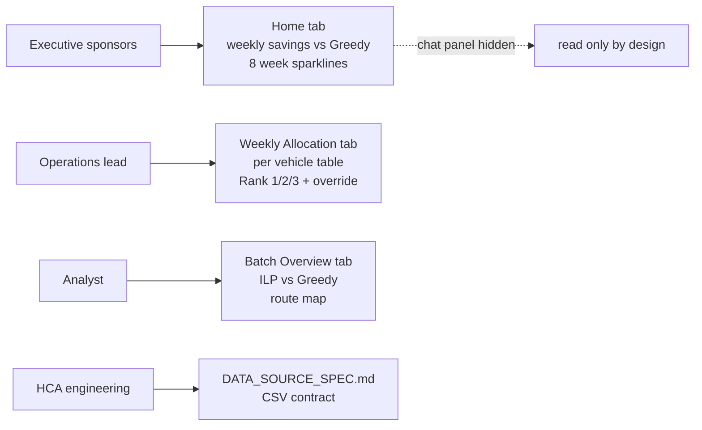

A three month capstone for Hyundai Capital America's Fleet-as-a-Service (FaaS) program. I built a full stack vehicle redistribution system: a two stage Integer Linear Program over 650 grounded vehicles and 30 FaaS dealers, a four tab dashboard for the executive, operations, and analyst roles, an MCP-driven Claude chat agent, and a deployment kit that HCA can install themselves. The brief, redistribute grounded vehicles to maximize program rent against carrier and tax cost, would normally be closed out in dollars per car per month and dollars per mile. HCA never shared those two figures during the engagement. The product had to be honest about that gap and still ship.

The decisions worth writing down are the ones that came out of the gap. Removing a synthetic revenue term once the operations lead flagged it had never been agreed with the business. Restructuring the score after a multiplicative scaling attempt failed. Overriding one optimization-derived weight when domain cost dominated by five to seven times. Designing the KPI surface so an executive could never misread a placeholder number as dollars.

The data gap is the whole story. Every architectural choice came back to it: how the scoring formula was shaped, what the dashboard showed, how the handoff was packaged, what the methodology document was honest about. The objective HCA wanted was straightforward in concept (send each car to the dealer that maximizes long run profit). The objective I could compute was different, because revenue per car per month and carrier cost per mile were never disclosed. The product had to hold up against both versions of the objective: useful today against natural unit signals, ready to collapse to dollar profit the moment HCA shares the two figures.

## TL;DR

1. **Context.** 650 grounded vehicles, 30 FaaS dealers, two stage ILP scored on utilization, demand, distance, and tax. No dollar inputs were ever delivered.
2. **Stakeholders.** Four user roles, four tabs, chat agent disabled on the executive view by design.
3. **Three product decisions.** Removed a synthetic revenue term (Apr 17). Restructured score from multiplicative to additive (Apr 21). Overrode one weight against the optimization output because real carrier cost dominated tax by five to seven times (Apr 24).
4. **KPI surface.** Switched from raw allocation score to rank based metrics so the dashboard could not be misread as dollars.
5. **Dependency management.** Treated the missing dollar inputs as explicit scaffolding with named collapse paths.
6. **Delivery.** Handoff tarball, idempotent installer, 60 test contract suite, CSV schema spec that doubles as the data contract.

| Section | Topic |
|---|---|
| 1 | Four users, four tabs |
| 2 | Three product decisions worth writing down |
| 3 | Why the dashboard shows Rank, not Score |
| 4 | Designing the system to absorb data it does not yet have |
| 5 | Three month cadence at the commit level |
| 6 | Packaging the capstone as a client deliverable |
| 7 | Retrospective: three judgment calls, one open question |

## 1. Four users, four tabs



*FIG.01: Each user role maps to exactly one surface. The chat agent is removed from the executive view because a tool that can answer anything will eventually be asked something it cannot honestly answer.*

The Home tab is the executive view. The chat panel, a Claude driven agent that answers freeform questions about the fleet, is visible on the three working tabs and hidden on Home. Removing the affordance on that page is a deliberate scope decision: the read only surface protects the executive from a tool that has not earned that level of trust yet.

A second guardrail: chat is rate limited to three messages per session. Not because API calls cost much, but because the deployment uses a shared key, and a curious stakeholder clicking through the demo would otherwise charge the program for everyone else.

## 2. Three product decisions worth writing down

### Removing the synthetic revenue term (2026-04-17)

The V1 score had a revenue term: dealer utilization multiplied by an assumed per car monthly rental figure, generating a dollar denominated objective. The figure was synthetic, derived from public comparables, never confirmed by HCA.

The operations lead said in a review that the synthetic number had never been agreed with the business and should not appear in any output. Two options: keep it with a footnote (ranking is preserved either way), or remove it.

I removed it the same day. A dollar value an executive will quote in their next meeting cannot rely on a disclaimer to be safe. The replacement was a natural unit additive score, which eventually became the basis of the final model.

### Restructuring from multiplicative to additive (2026-04-21)

The utilization signal needed to express two facts at once. High utilization rate is a good signal. A dealer with more cars actively earning is a stronger destination than a small dealer at the same rate. A three car dealer at 69 percent utilization has two cars earning. A 114 car dealer at 22 percent has 25. The latter is the better destination by any business reading of the data.

The first restructured form was multiplicative: `UTIL^β × (IN_SERVICE / median)^γ`. A 2,048 point Sobol sweep over `(β, γ)` collapsed γ to zero, which read as "size does not matter." Two defects explained the result. `IN_SERVICE` measures delivery state, not demand. And median normalization made every dealer's score depend on the rest of the data, breaking absolute comparisons.

The replacement was additive: `w_util × UTIL_RATE + w_rented × RENTED`. `RENTED` enters without normalization, so absolute demand survives any change in dealer mix. The four weights came from an 81,920 simulation 4-D Pareto knee sweep, geometrically closest point to a utopia corner in normalized outcome space. No weight was hand picked.

### Overriding the optimization output (2026-04-24)

The Pareto sweep returned `w_dist = 3.827`. Real per mile carrier cost was 560 to 840 dollars per vehicle. Real annual property tax was around 115 dollars per vehicle. The sweep had given distance and tax equal weight by construction (defensible in natural units, wrong once mapped back to business cost).

I overrode `w_dist` to 15.0, recorded the override date, the original Pareto output, and the business reasoning. The override sits in the code next to the original value as a comment. The methodology document explains the override before it explains the sweep. A derivation that is not wrong is not the same as a derivation that is right.

## 3. Why the dashboard shows Rank, not Score

The allocation score is a real number computed per `(vehicle, dealer)` pair, used inside the solver to rank candidates. It is not a dollar value. It is not comparable across vehicles. A Los Angeles car scoring 2.1 is not better placed than a Miami car scoring 1.4: Los Angeles has a denser set of busy dealers in range, so any Miami car will score lower. Miami's 1.4 may already be the best Miami can offer.

The dashboard never shows raw score in a KPI position. Weekly Allocation surfaces two metrics: `% at Rank 1` (share of vehicles assigned to their top candidate) and `Avg Rank` (mean assigned rank across the batch). Both are interpretable without reading methodology. "Twelve of seventeen cars got their first choice" is a sentence anyone can read.

Raw score appears as a small gray subtitle for auditability. Several stakeholders initially preferred a dollar denominated KPI, on the reasoning that finance speaks dollars. The counter argument was that a fake dollar number is worse than a real rank number, and the moment HCA shares real revenue and carrier rate, the score collapses to dollar profit per vehicle and the KPI conversion is a one line change.

## 4. Designing the system to absorb data it does not yet have

The two missing inputs are `$/car/month` rental revenue and `$/mile` carrier cost. The system was designed so that the moment either arrives, a small set of named coefficients are replaced and nothing else changes.

| Today's placeholder | What it becomes |
|---|---|
| `w_util` and `w_rented` weights | One revenue term: `$ per car per month` |
| `DISTANCE_NORM` scaffolding | One cost term: `$ per mile × distance` |
| `TAX_NORM` scaffolding | The existing dollar denominated tax term |

*FIG.02: Every placeholder names the dollar input that retires it. The methodology document points at the exact code locations.*

The naming is the contract. `w_util` is not "the utility weight," it is the placeholder that disappears when `$/car/month` arrives. The same posture shows up in the data interface. The engine reads nine CSVs from `data_csv/`. `DATA_SOURCE_SPEC.md` specifies filenames, columns, types, conventions (ZIP zero padded, utilization on 0 to 100 not 0 to 1, dealer codes prefixed `FD`). The spec is the data contract. HCA engineering rewrites the source CSVs against this contract and the system runs. `scripts/data_migration.py validate <dir>` reports schema drift before the engine starts.

## 5. Three month cadence at the commit level

| Period | Phase |
|---|---|
| 2026-02-26 to 2026-03-13 | Data exploration, schema design, ILP vs Greedy baseline |
| 2026-03-20 | Full stack MVP (FastAPI backend, vanilla JS UI, agent chat) |
| 2026-03-23 | Streaming SSE rebuild, dashboard fixes, drivable miles distance matrix |
| 2026-04-10 to 2026-04-14 | V2 engine refactor, tax column, audit pass |
| 2026-04-17 | Synthetic revenue term removed after operations review |
| 2026-04-21 | Multiplicative scoring retired, additive form adopted, 4-D Pareto sweep |
| 2026-04-24 | `w_dist` override applied |
| 2026-04-28 | Watchlist anomaly module |
| 2026-05-13 to 2026-05-16 | Deployment kit packaged, handoff tarball built |

*FIG.03: 61 commits across the engagement. The largest design changes were a single week (April 17 to 24). Momentum returned because the surrounding system was stable enough to keep working while the engine was being replaced.*

## 6. Packaging the capstone as a client deliverable

```bash
$ ./start.sh
[install] venv created at .venv
[install] 47 packages installed from app/requirements.txt
[server] port 8000 free
[server] FastAPI started on http://localhost:8000
[server] MCP endpoint mounted at /mcp (14 tools)
[browser] opened http://localhost:8000

$ .venv/bin/python -m pytest app/tests/ -q
.......................................................... 60 passed in 41.2s
```

*FIG.04: One command brings up the full stack on macOS, Linux, or Windows. 60 contract tests verify the install before HCA touches a button.*

The handoff layer:

1. `start.sh` and `bootstrap.py` are one command launchers. Both create the virtual environment if missing, install dependencies, free port 8000, and start the server. `bootstrap.py` runs on Windows too.
2. `deploy/` contains a 323 line installation guide, a systemd unit file, an idempotent installer, and a packer that produces a 532 KB tarball without development cruft.
3. `app/tests/` contains 60 pytest contract tests covering engine, REST endpoints, SSE chat, and MCP server. Suite runs in under a minute.
4. `DATA_SOURCE_SPEC.md` is the data contract. The validation script fails fast on schema drift.
5. `Reset` is a UI button. Fleet inventory CSV restores from a checked in baseline, so the demo is repeatable.

## 7. Retrospective: three judgment calls, one open question

Three calls I will reuse on the next engagement:

1. **Cut the synthetic revenue term the same day the operations lead flagged it.** A dollar number an executive will quote is load bearing. A footnote is not a fix.
2. **Choose Rank over Score for the executive facing KPI.** The cost was internal disagreement. The benefit is a dashboard that cannot be misread, and a one line conversion to dollars when HCA delivers the real inputs.
3. **Treat the missing dollar inputs as scaffolding with documented collapse paths.** The model is honest about what it does not know. The system is structured to absorb the answers when they arrive.

The open question: the additive form cannot answer "plus ten percent utilization is worth how many miles" without HCA's dollar inputs. The next iteration replaces the continuous utilization signal with a four tier bucket classification, so the question becomes "Tier 1 versus Tier 2 is worth how many miles." Categorical, business actionable, defensible without dollar inputs. The trade off is loss of intra tier discrimination and possible worsening of dealer concentration. Whether the trade is worth taking does not get decided on a whiteboard. It gets decided after a sweep across the same 80 fleet scenarios that calibrated the current model.

The capstone closes here. The data contract, the test suite, and the scaffolding around the missing inputs are what let the next iteration start from a known position rather than from scratch.
