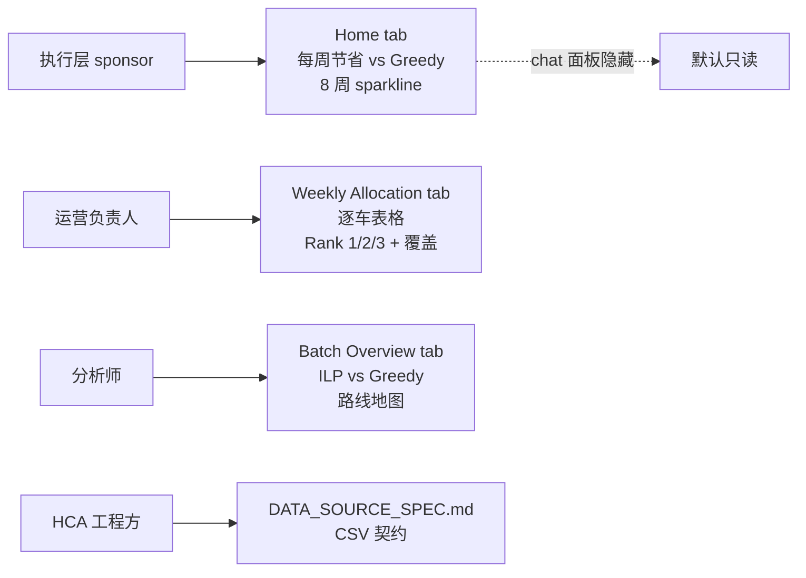

为 Hyundai Capital America 的 Fleet-as-a-Service（FaaS）项目做的三个月 capstone。我搭了一套完整的车辆重新分配系统：一个对 650 辆停场车与 30 家 FaaS 经销商求解的两阶段整数线性规划、一个面向执行层与运营、分析三类角色的四 tab dashboard、一个由 MCP 驱动的 Claude chat agent，以及一份 HCA 自己能装上的部署包。这道题在概念上很清楚：把停场车重新分配，最大化项目租金，扣除承运成本与州属性税。常规做法会用每车每月美元租金和每英里美元承运费率把目标函数算清楚。HCA 整个 engagement 期间没有交付这两个数字。产品必须对这个缺口诚实，并且仍然交付。

值得写下来的几个决策都来自这个缺口。运营负责人指出合成的收入项从来没和业务对过当天，我把它移除。第一次乘性归一化失败之后，把评分公式改成加性结构。当优化算法给出的距离权重与真实承运成本量级差五到七倍时，我手工覆盖了那一项。KPI 表层从一开始就设计成 executive 不会把占位数字误读为美元。

数据缺口是整个故事。所有架构选择最后都回到这一点：评分公式怎么搭、dashboard 显示什么、handoff 怎么打包、方法学文档对哪些事情态度诚实。HCA 想要的目标在概念上很清楚（把每辆车送到长期利润最大化的经销商）。我实际能算的目标和这个不一样，因为每车每月的租金和每英里的承运费率没有交付。产品需要对两版目标函数同时成立：今天在自然单位下能用；HCA 一旦交付两个美元数字，整个评分就能 collapse 成每车的美元利润。

## TL;DR

1. **背景。** 650 辆停场车、30 家 FaaS 经销商，两阶段 ILP 评分项包括利用率、需求、距离、税。两个美元口径输入从未交付。
2. **Stakeholder。** 四类用户角色对应四个 tab，executive 视图上故意把 chat agent 关掉。
3. **三个产品决策。** 4 月 17 日移除合成的收入项；4 月 21 日把评分从乘性结构改成加性结构；4 月 24 日基于真实承运成本，手工覆盖优化算法给出的距离权重。
4. **KPI 表层。** 从原始 score 切到基于 rank 的指标，让 dashboard 不会被读成美元。
5. **依赖管理。** 把缺失的美元输入做成显式脚手架，每个占位权重都标注了 collapse 路径。
6. **交付。** 一个 handoff tarball、一份幂等安装脚本、60 个用例的契约测试、一份既是 schema 又是数据契约的 CSV 规范。

| 章节 | 主题 |
|---|---|
| 1 | 四类用户，四个 tab |
| 2 | 三个值得写下来的产品决策 |
| 3 | 为什么 dashboard 显示 Rank，不显示 Score |
| 4 | 让系统能承载尚未到手的数据 |
| 5 | 三个月节奏，按 commit 看 |
| 6 | 把 capstone 包装成客户交付件 |
| 7 | 复盘：三个判断和一个未决问题 |

## 1. 四类用户，四个 tab



*FIG.01：每类用户角色对应一个界面。Home 上不放 chat agent，是因为一个能回答任意问题的工具，迟早会被问到它无法诚实回答的问题。*

Home 是执行层的视图。Chat 面板是一个由 Claude 驱动的 agent，回答关于车队的自由问题，出现在三个工作 tab 上，在 Home 上被隐藏。在执行层视图把入口去掉是有意识的范围决策：只读界面在 agent 还没建立起足够信任之前先保护 executive。

第二道护栏：chat 限速三条消息一个 session。原因不是 API 调用很贵，是部署用的是共享 API key，演示中一个好奇的 stakeholder 一直点下去，账单就由项目承担了。

## 2. 三个值得写下来的产品决策

### 移除合成的收入项（2026-04-17）

V1 评分公式包含一个收入项：经销商利用率乘以一个假定的每车每月租金，得到一个美元口径的目标。这个数字是合成的，来自公开行业可比口径，HCA 从未确认。

运营负责人在评审里指出，这个合成数字"我们从来没和业务侧对过"，不应该出现在任何输出里。两个选项：留下加脚注（无论留或不留，排序结果都成立），或者移除。

我当天移除了。一个 executive 会在下一个会议里引用的美元数字，不能依靠免责声明来保证安全。替换方案是自然单位下的加性 score，这个方案后来演化成了最终模型。

### 从乘性结构改造成加性结构（2026-04-21）

利用率信号需要同时表达两件事。高利用率是一个好信号；同样利用率下，绝对在租车辆数更多的经销商是更强的目的地。一家三车经销商 69% 利用率代表两辆在租。一家 114 车经销商 22% 利用率代表 25 辆在租。按业务理解，后者明显更值。

第一次改造用了乘性形式：`UTIL^β × (IN_SERVICE / median)^γ`。在 `(β, γ)` 上做一次 2,048 点的 Sobol 扫描，结果 γ 收敛到 0，读出来等于"规模无关"。两个缺陷解释了这个结果。`IN_SERVICE` 衡量的是交付状态，不是需求。按 median 归一化让每家经销商的得分依赖于其他经销商的数据，绝对量级的比较被破坏。

替换方案是加性结构：`w_util × UTIL_RATE + w_rented × RENTED`。`RENTED` 不做归一化进入公式，所以无论经销商组合怎么变，绝对需求都被保留。四个权重来自一次 81,920 次仿真的 4-D Pareto knee 扫描，定义是在归一化结果空间里到 utopia 角的几何最近点。没有任何权重是手调的。

### 覆盖优化算法的输出（2026-04-24）

Pareto 扫描给出 `w_dist = 3.827`。真实的每英里承运成本是每辆车 560 到 840 美元，真实的年属性税是每辆车约 115 美元。扫描在自然单位下默认给距离和税同等量级权重（在自然单位下合理，还原到真实业务成本时不成立）。

我把 `w_dist` 覆盖为 15.0，记录了覆盖日期、原始 Pareto 输出值、业务理由。代码里覆盖项旁边注释着原值。方法学文档先讲覆盖再讲扫描。一个推导没有错，不等于这个推导是对的。

## 3. 为什么 dashboard 显示 Rank，不显示 Score

Allocation score 是一个实数，按 `(车, 经销商)` 对计算，用来在求解器内部对候选排序。它不是美元金额。它也不能跨车比较。一辆洛杉矶得分 2.1 的车并不比一辆迈阿密得分 1.4 的车安置得更好：洛杉矶在驾驶半径内有更多繁忙的经销商，任何迈阿密的车都会得分更低。迈阿密的 1.4 可能已经是迈阿密能给出的最优解。

Dashboard 在任何 KPI 位置都不显示原始 score。Weekly Allocation 上的两个指标是 `% at Rank 1`（被分配到首选经销商的车辆比例）和 `Avg Rank`（一批中所有已分配车辆的平均 rank）。这两个数字不需要读方法学文档也能解读。"17 辆车里有 12 辆拿到了首选"是一句任何人都看得懂的话。

原始 score 作为灰色小字 subtitle 出现，仅用于审计。内部有 stakeholder 倾向于美元口径 KPI，理由是财务的人讲美元。反方理由：一个假美元数字比一个真 rank 数字更糟；HCA 一旦交付真实 revenue 和承运费率，score 自动 collapse 成每车的美元利润，KPI 一行代码就能切换。

## 4. 让系统能承载尚未到手的数据

缺失的两个输入是每车每月 `$/car/month` 的租金收入和每英里 `$/mile` 的承运成本。系统的设计目标是：这两个输入任意一个到手时，只需要替换少量被命名的系数，其他什么都不需要改。

| 当前的占位符 | 收到真实数据后变成什么 |
|---|---|
| `w_util` 和 `w_rented` 权重 | 一个收入项：`$ per car per month` |
| `DISTANCE_NORM` 脚手架 | 一个成本项：`$ per mile × distance` |
| `TAX_NORM` 脚手架 | 现有的美元口径税项 |

*FIG.02：每个占位符的命名直接指向能让它退役的那个美元输入。方法学文档列出了将要改动的精确代码位置。*

命名就是契约。`w_util` 不是"效用权重"，它是 `$/car/month` 到手时会消失的占位符。同样的设计姿态体现在数据接口上。引擎从 `data_csv/` 读取九份 CSV。`DATA_SOURCE_SPEC.md` 规定文件名、列名、类型、约定（ZIP 必须前导补零、利用率按 0 到 100 不是 0 到 1、FaaS 经销商代码以 `FD` 开头）。这份 spec 就是数据契约。HCA 工程方按这份契约重写来源 CSV，系统直接运行。`scripts/data_migration.py validate <dir>` 在引擎开始执行之前报告 schema 漂移。

## 5. 三个月节奏，按 commit 看

| 时段 | 阶段 |
|---|---|
| 2026-02-26 至 2026-03-13 | 数据探索、schema 设计、ILP 与 Greedy baseline |
| 2026-03-20 | 全栈 MVP（FastAPI 后端、原生 JS UI、agent chat） |
| 2026-03-23 | 流式 SSE 重写、dashboard 修复、距离矩阵改为可驾驶英里 |
| 2026-04-10 至 2026-04-14 | V2 引擎重构、税列接入、审计走查 |
| 2026-04-17 | 运营负责人评审后移除合成的收入项 |
| 2026-04-21 | 乘性评分淘汰，改为加性结构，运行 4-D Pareto 扫描 |
| 2026-04-24 | `w_dist` 覆盖落地 |
| 2026-04-28 | Watchlist 异常检测模块接入 |
| 2026-05-13 至 2026-05-16 | 部署包打包，handoff tarball 装载 |

*FIG.03：engagement 期间共 61 次 commit。最大的设计变更集中在一周内（4 月 17 至 24 日）。节奏能回来，是因为外围系统稳定到引擎被替换时仍然独立运行。*

## 6. 把 capstone 包装成客户交付件

```bash
$ ./start.sh
[install] venv created at .venv
[install] 47 packages installed from app/requirements.txt
[server] port 8000 free
[server] FastAPI started on http://localhost:8000
[server] MCP endpoint mounted at /mcp (14 tools)
[browser] opened http://localhost:8000

$ .venv/bin/python -m pytest app/tests/ -q
.......................................................... 60 passed in 41.2s
```

*FIG.04：一条命令在 macOS、Linux 或 Windows 上启动全栈。60 个契约测试在 HCA 触碰按钮之前先验证安装。*

交付层包括：

1. `start.sh` 与 `bootstrap.py` 是一行命令的启动器。两个脚本都会在缺失时建虚拟环境、装依赖、释放 8000 端口、启动服务。`bootstrap.py` 也在 Windows 上独立运行。
2. `deploy/` 目录包含 323 行的部署指南、systemd unit、幂等安装脚本、以及一个把应用打成 532 KB tarball 的打包器，不含开发周边。
3. `app/tests/` 包含 60 个 pytest 契约测试，覆盖引擎、REST 端点、SSE chat、MCP 服务器。完整套件一分钟内执行完毕。
4. `DATA_SOURCE_SPEC.md` 是数据契约。校验脚本在 schema 漂移时尽早失败。
5. `Reset` 是 UI 上的一个按钮。Fleet 库存 CSV 从签入的 baseline 恢复，演示可重复执行。

## 7. 复盘：三个判断和一个未决问题

下一个 engagement 我会复用的三个判断：

1. **运营负责人指出问题的当天就把合成收入项切掉。** 一个 executive 会引用的美元数字是产品里承载性最强的元素。脚注不是修复。
2. **选 Rank 而不是 Score 作为面向 executive 的 KPI。** 代价是内部分歧。收益是 dashboard 不会被读错，并且 HCA 交付真实输入时 KPI 切换只需要一行代码。
3. **把缺失的美元输入当作有 collapse 路径的脚手架。** 模型对自己不知道的事情态度诚实，系统结构允许真实数据到来时直接承载。

未决的问题：加性结构在没有真实美元输入时回答不了"+10% 利用率值多少英里"。下一轮迭代用四档分桶分类来替换连续利用率信号，问题就变成"Tier 1 比 Tier 2 值多少英里"。问题转成离散类别后，业务上可执行，没有美元数据也能辩护。代价是 tier 内部失去区分度，并且可能让经销商集中度变差。这个权衡值不值得，不会在白板上决定，会在和当前模型同样的 80 个 fleet 场景扫描结果上决定。

Capstone 在这里收尾。数据契约、测试套件、围绕缺失输入搭起的脚手架，让下一轮迭代能从一个已知位置起步，而不是从零开始。
