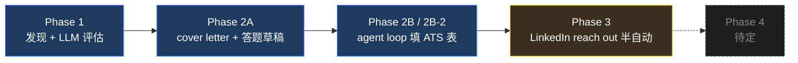

2026 年的应届一季要投出去几百封简历，才能换到几个面试。简历没有为每家公司改过。开头那段「Why this company」也没有真的针对每家公司写。HR 那边的系统也知道，关键词命中率就那么几个数。这是一份双方默认的契约：双方都知道这是初筛过滤、不是认真审阅，candidate 要做的只有一件事，就是过掉对方系统那道闸、拿到 recruiter call。所有人都在这套规则下玩。在这套规则下还花一整天给每家公司「精修」简历，就是给自己上税。joba 是我承认这件事之后做出来的工具。

把求职投递拆开看，它是一根五段的流水线：发现岗位、评估匹配度、起草 cover letter 与答题、填 ATS 表单、联系 hiring manager。每段单独都有现成工具，但它们不组合成一根管子。joba 的赌注是把这五段在我自己的机器上接通：本地 SQLite、本地浏览器、我自己的 LinkedIn cookie、我自己的 Claude Code 订阅。不上云端，不分发，不开放 API。



*FIG.01：流水线截至 2026-05-04 的状态。Phase 1 加 Phase 2（2A / 2B / 2B-2）全部上线；Phase 3（LinkedIn 联络半自动）进行中。原本的 Phase 3（auto-detect submit 后 auto-mark applied）因为我划下了「joba 永不自动点我自己的『已申请』按钮」这条红线，被剔除，reach out 顺延上来。Phase 4 留空，等 Phase 3 跑稳一周再选。*

第一段是发现加评估。patchright 起一个有头浏览器，复用我登录后的 cookie，访问 LinkedIn 推荐池 `/jobs/collections/recommended/`，抓出一组岗位卡片，再逐条进详情页拉 `main` inner_text 加 「About the job / About the company / More jobs from」三个文本 anchor 切片。每条用 `(company, title, city)` 算 fingerprint 去重，没见过的喂给 `claude` CLI 子进程（opus 4.7，`--json-schema` 强制结构化输出），返回六个字段：verdict、完整英文 jd_summary、原文英文 requirements、英文 company_summary、中文 reasons、中文 signals。设计上唯一的执拗：jd_summary 故意保留整段英文原文不浓缩。我要先看完整 context，再决定要不要反转 LLM 的 verdict。

<div class="joba-mock joba-mock--list" aria-label="joba 推荐岗位列表 mockup">
  <div class="joba-mock__head">
    <span class="joba-mock__title">推荐</span>
    <span class="joba-mock__count">5 / 5 已评估</span>
  </div>
  <ul class="joba-mock__joblist">
    <li class="joba-mock__job joba-mock__job--apply">
      <div class="joba-mock__job-head">
        <span class="joba-mock__job-company">Anthropic</span>
        <span class="joba-mock__verdict joba-mock__verdict--apply">apply</span>
      </div>
      <div class="joba-mock__job-title">Forward Deployed Engineer</div>
      <div class="joba-mock__job-meta"><span>San Francisco, CA</span><span>Easy Apply</span><span>fp: 7c4a</span></div>
      <div class="joba-mock__job-reason">现场部署 + Python/TypeScript + 企业落地经验匹配 capstone solver 工作；JD 列的栈跟简历一一对得上。</div>
    </li>
    <li class="joba-mock__job joba-mock__job--apply">
      <div class="joba-mock__job-head">
        <span class="joba-mock__job-company">Scale AI</span>
        <span class="joba-mock__verdict joba-mock__verdict--apply">apply</span>
      </div>
      <div class="joba-mock__job-title">ML Engineer, Eval Pipelines</div>
      <div class="joba-mock__job-meta"><span>San Francisco, CA</span><span>External</span><span>fp: 91b2</span></div>
      <div class="joba-mock__job-reason">eval 流水线为主、Python 重；JD 写到 vector retrieval + judge-LLM，正是这季节做过的两次。</div>
    </li>
    <li class="joba-mock__job joba-mock__job--skip">
      <div class="joba-mock__job-head">
        <span class="joba-mock__job-company">Palantir</span>
        <span class="joba-mock__verdict joba-mock__verdict--skip">skip</span>
      </div>
      <div class="joba-mock__job-title">Forward Deployed Software Engineer III</div>
      <div class="joba-mock__job-meta"><span>Washington, DC</span><span>External</span><span>fp: 4d18</span></div>
      <div class="joba-mock__job-reason">国防 / clearance 锁定；JD 要求 active TS 以上。preferences.md 硬规则跳过。</div>
    </li>
  </ul>
</div>

*FIG.02：发现加评估输出。每张卡上的 verdict chip、fingerprint、`claude` 子进程回的 reason 在一个块里展示（英文岗位描述给国际公司，中文 signals 在右侧）。verdict 只是默认值，我可以反转任何一张卡，`user_overridden=1` 之后下次同步 LLM 不再覆盖。*

第二段是起草面板。apply 候选岗位点「投递助手」，打开一个 Dialog，里面同时摆出 sonnet 现生的 cover letter（按 fingerprint 缓存）、7 段固定的标准答题模板（visa、YOE、薪资、入职、工作模式、个人信息、cover letter 要点），以及 JD requirements 和 company summary。这一段不是「替我填表」，而是「把我所有要复制粘贴的东西摆在同一块屏上，让下面那段填表退化成一次剪贴板操作」。

<div class="joba-mock joba-mock--dialog" aria-label="joba 投递助手 Dialog mockup">
  <div class="joba-mock__dialog-head">投递助手 · Anthropic / Forward Deployed Engineer</div>
  <div class="joba-mock__dialog-grid">
    <section class="joba-mock__pane">
      <div class="joba-mock__pane-head"><span>Cover Letter</span><span class="joba-mock__copy">复制</span></div>
      <p>I have spent the last year shipping forward-deployed AI tooling end-to-end: from JD ingestion and fingerprint-based dedup to MCP tool gating and budget-watchdog agent loops.</p>
      <p>The Forward Deployed Engineer role at Anthropic is the closest fit I have read this season. The mix of customer-facing rollout and infra design is what I have been doing on solo capstones at small scale, and I want to do it where the model itself is owned.</p>
    </section>
    <section class="joba-mock__pane">
      <div class="joba-mock__pane-head"><span>标准答题</span><span class="joba-mock__copy">复制</span></div>
      <ul class="joba-mock__answers">
        <li><b>Visa</b><span>不需要 sponsorship。</span></li>
        <li><b>YOE</b><span>合计 5 年，其中 2 年 prod AI。</span></li>
        <li><b>薪资</b><span>$180k–$220k base，equity 可谈。</span></li>
        <li><b>入职</b><span>offer 后两周。</span></li>
        <li><b>模式</b><span>SF 混合优先。</span></li>
        <li><b>信息</b><span>美国公民，加州常驻。</span></li>
      </ul>
    </section>
  </div>
</div>

*FIG.03：投递助手 Dialog。左栏是 sonnet 按 fingerprint 缓存的 cover letter，重新打开 Dialog 不会重生成。右栏是模板 tab 里编辑过一次的 7 段固定答题，这里只是个让剪贴板能直接抓的只读视图。*

第三段最难，因为「无人值守」要碰真号加真 ATS 表。joba 起一个本地随机端口的 HTTP server，patchright Page 由它独占；spawn 一个 `claude -p --model opus` 子进程，加 `--strict-mcp-config` 加载我们写的 ad-hoc MCP server，工具集只有 10 个：`list_form_fields`、`fill_text_field`、`select_option`、`click_radio`、`click_checkbox`、`fill_date`、`upload_file`（slot 白名单）、`scroll_to`、`get_screenshot`、`report_progress`。

```text
不在工具集里（即使 Claude 让加也不加）：
  goto_url / back / reload
  click(任意 selector)
  evaluate_js(任意脚本)
  submit_form / press_enter
  set_cookie / local_storage_*
  任意路径文件读写
```

*FIG.04：受限 MCP 工具集的「不暴露」清单。安全押在 attack surface 而不是 prompt 上：Claude 不能点 Submit，不是因为 prompt 让它别点，而是因为没有那个工具。*

翻页走一道独立的 gate。sonnet 给候选「下一页」按钮的 label，先过一条 `(submit|apply|send|finalize|finish|confirm|complete|提交|申请|完成|确认)` 黑名单正则；点完之后新 URL path 不能命中 `/confirm|/complete|/thank|/success|/done|/submitted`；单 session 累计自动翻页 ≤ 5 次。三条规则串行，全过才点，任一不过就停下让我看。Watchdog 200 ms tick，在墙钟、tool 调用数、cost、no-progress 超时、stop 文件、浮窗 stop flag 之间任一触发就 SIGTERM claude。监控两路并发：tab 内一个浮窗 panel 用 `page.evaluate` 推事件绕开 ATS 站点的 CSP；joba UI 同源 SSE 拿到信息密度更高的时间线。

<div class="joba-mock joba-mock--monitor" aria-label="joba auto-apply 实时监控 mockup">
  <div class="joba-mock__monitor-head">
    <span class="joba-mock__monitor-title">Auto Apply · running</span>
    <div class="joba-mock__monitor-stats">
      <span>14 calls</span>
      <span>02:31</span>
      <span>$0.42</span>
    </div>
  </div>
  <ul class="joba-mock__timeline">
    <li class="joba-mock__t-item"><code>list_form_fields</code> → 28 个字段</li>
    <li class="joba-mock__t-item"><code>fill_text_field("first_name", "Chao")</code></li>
    <li class="joba-mock__t-item"><code>fill_text_field("last_name", "Yao")</code></li>
    <li class="joba-mock__t-item"><code>fill_text_field("email", "...")</code></li>
    <li class="joba-mock__t-item"><code>upload_file("resume", active_resume_pdf)</code></li>
    <li class="joba-mock__t-item"><code>click_radio("auth_to_work_us", true)</code></li>
    <li class="joba-mock__t-item"><code>click_checkbox("contact_consent", true)</code></li>
    <li class="joba-mock__t-item"><code>fill_text_field("years_experience", "5")</code></li>
    <li class="joba-mock__t-item"><code>fill_text_field("cover_letter", &lt;1.4kB&gt;)</code></li>
    <li class="joba-mock__t-item joba-mock__t-item--running"><code>select_combobox("country", "United States")</code> ...</li>
  </ul>
</div>

*FIG.05：joba UI 端的实时监控。同一份事件流也通过 `page.evaluate` 推进 patchright tab 里一个 320 像素宽的浮窗（因为 ATS 站的 CSP 会 ban 掉 SSE 到 localhost）。Stop 按钮写 stop 文件，watchdog 在 200 ms 内 SIGTERM claude。*

Phase 3 是 reach out 半自动，进行中。从 applied 卡片点「找人 reach out」，joba 调 `stickerdaniel/linkedin-mcp-server` 在同公司同地点找出三位 senior 或 manager，sonnet 起草一条 ≤200 字符、引用候选人具体经历的 connect note，「联络」tab 按 job 把草稿分组。点一次发送就在一个有头 patchright 串行处理：自动开 profile、点 Connect、paste note，**停下让我自己点 Send**，joba 永远不自动点对话框最终的 Send 按钮。当日 connect ≥ 5 强制停 + 通知。Phase 4 暂时不排：原本的「外部 ATS 全自动填表」因为大多数候选岗位虽然不是 Easy Apply 但成本对体量不划算，被降级；编排守门也丢进同一个 TBD 桶里。

Phase 3 跑出来的第一条硬规则是 single session：任意时刻只让一个 patchright 进程跟 LinkedIn 通信。LinkedIn 风控把 cookie、浏览器指纹、并发请求模式三层信号叠加打分；两个并发的 patchright 在它眼里就是「两台设备同时在自动化」，跟它们各自拿什么 cookie 无关。`data/.linkedin_lock` 文件加 `flock` 让所有入口（discover、auto-apply、outreach、linkedin-mcp 子进程）启动前先 acquire；前端把所有「会启 patchright」的按钮按 lock 状态置灰。我 v0 写的「每天 ≤120 动作」counter 被证明是错的 frame：LinkedIn 看的是模式和信号叠加，不是请求总量。Mutex 串行 + 「收到一封警告邮件就停七天」取代了那条预算。

第二条方法论是从清 Phase 2B 的 bug 清出来的：**backend 是真相，frontend 只是投影**。规则：跨刷新、跨 tab、由 backend 子进程产生的状态归 backend；前端只 own 输入草稿和 UI-local 交互态。任何 backend-owned 状态都要能从 status API（pull）或 SSE 流（必须支持 `Last-Event-ID` 重连重放）重新派生。Optimistic UI 只能作为下一次 reconcile 之前的"反应桥"，不能脱离 reconcile 单独存在。我 Phase 2B 的 bug 一半是这个原则的违例：`useState` 跟踪在跑的子进程、Dialog 一关就丢进度、SSE 每次 mount 重发全部事件。

针对主号 LinkedIn 的浏览器自动化不是一个能彻底解决的问题，文章里也得这么写。我自己内部对「不被封」的诚实估计：第一周约 95%、第一个月约 85–90%、三个月约 70–80%、六个月约 50–65%。衰减不是请求频率，是模式累积，要几周尺度才稳。任何比这更精确的数字都是骗人的。硬缓解（mutex / ≤5 connect 每天 / URL 命中 `/checkpoint|/captcha|/uas/|/authwall` 立刻停 / 零重试 / 零自动 Send）能让曲线不崩，但真正的安全只有一种：LinkedIn 给警告邮件时认真读 + 立刻停七天。

「全自动」对我的意义不是按一个按钮把 200 封简历发出去，而是这条管子没有任何一段在偷偷把一小时还给我。今天它端到端跑通到 Phase 3 的 dry-run、单日 reach-out 顶到五、每个入口都过同一把 lock。Phase 4 是什么，等 Phase 3 干净跑一周之后再选。
