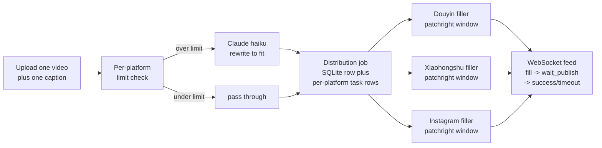

I built Social Platforms because the act of posting one video to Douyin, Xiaohongshu, and Instagram should not be three separate exercises in copying, pasting, and re-trimming the title. The tool takes one upload and one caption, then opens one browser window per target platform, fills the form, and stops just short of the publish button so I can eyeball each post before clicking. Where a platform's title cap is shorter than my caption (Douyin at 30, Xiaohongshu at 20, Tencent at 16, Instagram at 2200), Claude haiku rewrites in place to fit. The platforms speak Chinese and run hostile bot-detection, so the browser layer is patchright (a stealth fork of Playwright), the auth layer is per-platform Playwright `storage_state` cookies, and the orchestrator is a single FastAPI process with a SQLite job table and a WebSocket feed.

The thing the existing tools get wrong is that they either auto-publish (which is how you end up with a typo on three platforms) or they make you babysit each tab manually. I wanted the middle path: the system fills the form for me, and the human (me) does the final read-and-publish. That single design decision drove most of the architecture below.



*FIG.01: One job row in SQLite owns N per-platform task rows, each driven by an isolated patchright filler. The frontend subscribes once over WebSocket and reads task transitions live.*

The content adapter is the simplest piece of AI in the whole stack and the one users notice most. The rule is: if the caption fits the platform's `title_limit`, pass it through verbatim. If not, send it to Claude haiku with a one-shot prompt that says "rewrite this title in N Chinese characters or fewer, preserve the hook, do not add hashtags." When the API key is missing, the adapter falls back to a hard truncate at the limit. Treating the AI as an optional layer over a deterministic core was a real choice. It means the system stays useful at 3am with no internet, and it means I can swap haiku for a stronger model later without rewriting the orchestrator.

```python
async def adapt_title(raw: str, limit: int | None) -> str:
    if limit is None or len(raw) <= limit:
        return raw
    if not settings.anthropic_api_key:
        return raw[:limit]
    msg = await client.messages.create(
        model="claude-haiku-4-5-20251001",
        max_tokens=120,
        messages=[{"role": "user", "content": REWRITE_PROMPT.format(
            raw=raw, limit=limit
        )}],
    )
    return msg.content[0].text.strip()[:limit]
```

*FIG.02: The "AI is a fallback over a deterministic core" pattern. Tens of bytes of business rule, one prompt, one truncate. The interesting line is the last one: the rewriter is allowed to overshoot, and the truncate is the contract.*

The hardest part was not the AI. It was the browser life cycle. Each platform filler runs `async with patchright.chromium ...`, opens a context with the saved `storage_state`, navigates to the creator URL, drag-drops the video, waits for the upload spinner to clear (`VIDEO_PROCESS_TIMEOUT_SEC = 600`), fills the title and tags, and then waits up to 30 minutes for me to click publish. If anything along that path raises, the context and browser must both close, the SQLite task row must flip to `failed`, and the parent job's status must be recomputed. Two cross-audits in April 2026 (sixteen reviewer passes) turned up the failure modes I had missed: an `asyncio.create_task` that gets garbage-collected before it runs (fix: hold a reference in `_background_tasks`), a `clients.discard()` that races a `for client in clients: await broadcast(client)` loop (fix: iterate `list(clients)`), and a "stuck in distributing forever" bug where a filler crashed before its task row updated (fix: every endpoint that reads job state recomputes it from the platform rows, and `init_db()` runs `recover_stale_jobs()` on boot).

```text
$ tail -f data/jobs.log
[09:42:11] job 7c3a accept   video=demo.mp4 caption_len=87
[09:42:11] douyin       fill_started
[09:42:11] xiaohongshu  fill_started
[09:42:11] instagram    fill_started
[09:42:18] douyin       title_overflowed -> claude_rewrite -> 28 chars
[09:42:31] xiaohongshu  filled, awaiting human publish
[09:43:02] douyin       filled, awaiting human publish
[09:43:14] instagram    filled, awaiting human publish
[09:46:55] xiaohongshu  url_match /publish/success -> published
[09:47:22] douyin       url_match /content/manage    -> published
[09:48:01] instagram    dom_match "已分享"            -> published
[09:48:01] job 7c3a     completed (3/3)
```

*FIG.03: A real run end to end. Note that detection is per-platform: Douyin and Xiaohongshu signal success with a URL redirect; Instagram never changes URL because the upload is a modal, so the filler matches the "已分享" / "reel has been shared" text in the DOM.*

The shipped version covers Douyin, Xiaohongshu, and Instagram. Kuaishou and Tencent (微信视频号) have entries in `platforms.yaml` with `enabled: false` and no filler module yet. The next move is the Tencent filler, because Tencent has the tightest title limit (16 characters) and is the most interesting test of the rewrite layer. After that, the open product question is whether to add a "schedule" mode (post N hours from now) or a "campaign" mode (one video to multiple personas with per-persona caption variants). Both are real asks from the way I actually use the tool. `[VERIFY: throughput numbers, the system has been running for me but I have not measured average end-to-end seconds per platform under nominal cookie health]`.
