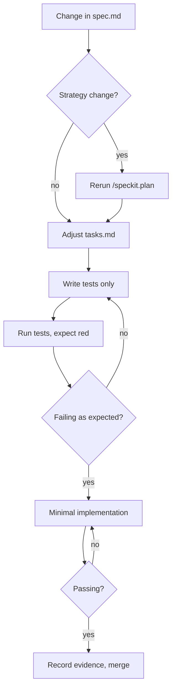

I did not invent SpecKit. SpecKit is an open framework for spec-driven AI development: a set of slash commands (`/speckit.constitution`, `/speckit.specify`, `/speckit.plan`, `/speckit.tasks`, `/speckit.implement`) and document templates (`spec.md`, `plan.md`, `tasks.md`) that turn an LLM coding session into a series of artifacts you can diff, review, and replay. I adopted it as the planning surface for everything I run through Claude Code, and over a few months I distilled a small set of iteration rules that keep the spec, plan, tasks, and tests honest. The rules are what I am claiming as my contribution. The framework underneath was already there.

The failure mode I kept hitting before the discipline was the one LLMs love: silently compress the red-green loop. Ask the model to write a feature, and it will happily produce code plus tests where the tests pass because the implementation was generated with the test in mind. SpecKit gives you the artifacts, but it does not enforce that you actually run the tests as a failing red step before writing the implementation. The discipline I layered on top is the part that turns the framework into a workflow.

*FIG.01: the per-iteration loop. The branches the framework does not enforce are the branches I had to enforce by hand.*

The three rules that mattered most are short. First, do not rerun `/speckit.plan` for implementation drift. Plans answer "how to do this," not "how to write this line of code." If only the implementation details changed, edit `tasks.md` directly and leave the plan alone. Rerunning the plan generator on every change is how plans drift away from the work. Second, split "write tests" from "implement" into two separate task entries so the agent cannot quietly produce both at once. Third, demand evidence: capture failing test output and passing test output as artifacts that live in the iteration log, not as claims in chat.

For large features I slice into milestones where every milestone delivers a verifiable vertical slice: a spec change, a plan or task change, tests committed, implementation, real test output. The work I did was not building any of that machinery. It was figuring out which steps the framework lets you skip, and refusing to skip them.

The full writeup is in the blog post: [Spec-Kit: Iteration, Planning, and TDD Notes](/blog/spec-kit/). It covers the change-request format I use in `spec.md`, the prompt templates I use to keep the agent on rails, the milestone slicing example for a signup feature, and the traceability rules that link each milestone back to its spec revision.

`[VERIFY: how often the discipline catches the compress-red-green-loop failure mode in practice]`. `[VERIFY: any concrete metric on iteration time before vs. after the discipline]`. The qualitative argument is solid; the numbers I will fill in once I have a clean log of milestone runs.
