Most early-rise alarms fail at the same step. The user is in bed, the snooze button is one tap away, and willpower at 6:30 a.m. is not the asset the app is supposed to depend on. ToiletAlarm is an iOS 26 alarm built around a single rule that removes the negotiation: the alarm only stops when your camera classifies a target object on-device, and the system-level alarm channel keeps ringing until that happens. The default target is the toilet (hence 马桶闹钟); cookware and a water vessel are also accepted, because the only requirement is that you have to physically get up to find one.

<div class="product-screens">
  <figure>
    
    <figcaption>Onboarding · 起床承诺</figcaption>
  </figure>
  <figure>
    
    <figcaption>Alarm list · 空状态</figcaption>
  </figure>
  <figure>
    
    <figcaption>新建闹钟 · 时间 / 重复 / 标签 / 铃声</figcaption>
  </figure>
  <figure>
    
    <figcaption>拍摄目标物品</figcaption>
  </figure>
  <figure>
    
    <figcaption>未命中 · 再试一次</figcaption>
  </figure>
</div>

*FIG.01: the four screens of the daily loop. Onboarding sells the contract; the list is the home; the editor is one sheet of native pickers; the camera is the only path out of a ringing alarm.*

The interesting choice was treating this as an AlarmKit problem, not a notification problem. iOS 14 to iOS 25 alarm-style apps had to abuse the notification system: schedule sixty-four queued notifications, hope the user hits the right banner, fall back to background audio that gets nuked by Focus and silent mode. iOS 26 added `AlarmKit` as a system framework and that ceiling went away. Schedule one alarm with `AlarmManager.shared.schedule(id:, configuration:)` and the system handles everything else: full-screen alert that bypasses Focus and the silent switch, audio that keeps playing even after the app is killed, automatic Live Activity on the lock screen and Dynamic Island, restart-resilience. There is no "chain", no "64 budget", no foreground audio dance. The app code shrinks to a wrapper around `AlarmManager`.

```mermaid
flowchart LR
  Sched["AlarmKit schedule()"] --> Sys["iOS system alarm channel"]
  Sys -->|fires at time| Alert["Full-screen alert<br/>(bypasses Focus + silent)"]
  Alert -->|user taps Stop| Intent["DismissByPhotoIntent<br/>openAppWhenRun=true"]
  Intent --> AppState["AppState.triggerCameraDismiss"]
  AppState --> Cam["RootView.fullScreenCover<br/>CameraView"]
  Cam -->|capture| Vision["VNClassifyImageRequest<br/>top-20 vs ObjectTarget"]
  Vision -->|match ≥ 0.05| Stop["AlarmManager.stop(id:)"]
  Vision -->|miss| Cam
  Stop --> End["Alarm silent · screen dismisses"]
```



*FIG.02: the dismiss path. The alarm continues ringing through the entire flow. The intent only opens the app; only a successful Vision match calls `stop(id:)`. If the user kills the app mid-flow the alert is still on the lock screen, still ringing, and re-opening the app re-enters the same camera view.*

The classifier strategy is the second decision worth defending. I did not train a custom Core ML model. `VNClassifyImageRequest` ships with a pre-trained classifier inside the OS that emits ImageNet-style identifiers like `toilet_seat`, `frying_pan`, `water_bottle`. The recognition service runs the request, takes the top twenty results, and tests each one against a hand-curated `ObjectTarget.acceptedIdentifiers` list with a confidence threshold of `0.05` (intentionally low: the goal is "is the target plausibly in the frame" not "what is this thing"). Three target categories cover most morning surfaces:

```swift
case toilet:
  ["toilet_seat", "toilet", "bathroom", "washbasin", "bathtub"]
case cookware:
  ["frying_pan", "wok", "pot", "saucepan", "Dutch_oven", "skillet",
   "stove", "kettle", "soup_bowl", "ladle", "stockpot", ...]
case waterVessel:
  ["water_bottle", "water_jug", "cup", "mug", "coffeepot",
   "pitcher", "drinking_glass", "goblet", ...]
```

```swift
private let confidenceThreshold: Float = 0.05
let request = VNClassifyImageRequest()
```

*FIG.03: the entire ML stack is two lines plus a synonym table. There is no model file in the bundle, no training data, no inference budget to worry about. The trade-off is that I cannot add a category the OS classifier never learned (a rice cooker, a thermos), but I get free upgrades whenever Apple ships a better classifier.*

The third piece is the dismissal contract. The Stop button on the AlarmKit alert is bound to a `DismissByPhotoIntent` declared as a `LiveActivityIntent` with `openAppWhenRun = true`. When the user taps Stop the OS launches the app, the intent's `perform()` calls `AppState.shared?.triggerCameraDismiss(alarmId:)`, and the root view's `fullScreenCover(isPresented: $appState.isRinging)` switches to `CameraView`. Crucially, the intent does not call `AlarmManager.stop(id:)`. Stopping the alarm at the intent level would let a determined user dismiss the alert and never reach the camera. Instead the alarm keeps ringing through the camera screen, through every failed capture, until the recognition service returns a hit and `CameraView`'s `onStopAlarm` callback fires.

The audio architecture follows the same separation. The ringtone itself is the AlarmKit system channel, played by the OS. Once the camera flow is on screen, an in-app `AVAudioPlayer` loop takes over from the system channel so the user hears continuous noise without the system alert chrome on top. Then the post-recognition `stop(id:)` call quiets both. The setting page's ringtone preview uses a separate `AVAudioPlayer` against the media volume bus so users can sample sounds without setting off the system channel.

Privacy was the constraint that shaped the architecture and the marketing copy in equal measure. The product label `图像只在本机识别，不上传、不保存` (images are classified on-device, not uploaded, not stored) is enforced by the code. The capture buffer becomes a `UIImage`, runs through the Vision request inside a `Task.detached`, and is released. There is no network layer in the app. There is no analytics SDK. The classifier returns a `RecognitionResult` value and the image is gone. The privacy story is the same as the source code.

The implementation has one architectural rule worth surfacing because it bit me twice. `@Observable` and `NSObject` cannot coexist on the same class in Swift 5.9. `AVCapturePhotoCaptureDelegate` requires `NSObject` conformance, and `CameraManager` needs `@Observable` for SwiftUI binding, so the photo delegate lives in a separate `PhotoCaptureDelegate` class. Same with timing: never `DispatchQueue.main.asyncAfter` for SwiftUI animation sequencing, only `Task.sleep` or `.delay()` modifiers, because the former breaks the diff. Both rules are pinned in the project's CLAUDE.md as P1 violations.

After three weeks of running this on a real iPhone the loop holds. The AlarmKit alert always fires (Focus, silent switch, do-not-disturb all bypassed). The Vision classifier hits the toilet on the first try about ninety percent of the time; the failure cases are mostly poorly-lit angles where the bowl rim alone is in the frame. The "wake up in bed and dismiss" failure mode is gone: there is no path from a ringing alarm to silence that does not involve standing up, walking to a target object, and pointing a camera at it. That is the whole product.
