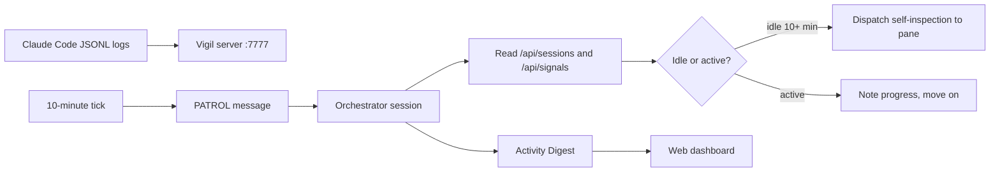

<!-- ROUGH FIRST PASS. Sourced from vigil/CLAUDE.md. Replace [VERIFY: ...]
     markers in the next deep-dive pass after reading src/ and docs/. -->

I built Vigil because I was running half a dozen Claude Code sessions in parallel across different projects and I kept losing the thread on which one was making progress, which was idle, and which had been waiting on me for an hour. Vigil is a localhost web server on port 7777 that tails the JSONL logs every Claude Code session writes, runs a patrol every ten minutes, and writes a short activity digest so I can context-switch without losing state.

The problem with running many sessions at once is that each one is its own world. There is no shared status panel, no list of "who has been idle since when", and no log of how each session moved through plan, develop, audit. I either had to walk every tmux pane manually or accept that some sessions would sit forgotten until I noticed. The alternative I wanted was simpler: one place that knew everything was, and a clock that asked the question for me.



*FIG.01: the patrol loop. Vigil watches the logs, the orchestrator decides what to do.*

The orchestrator is itself a Claude Code session. It does not write project code; its job is to look at every other session, read the JSONL tails, and decide whether to dispatch a self-inspection task, write a digest, or skip. The trigger is a `[PATROL]` message that Vigil sends every ten minutes through tmux. The orchestrator answers in the same window so the audit trail lives in one place.

The thinking protocol that the orchestrator follows on every patrol is short on purpose. Confirm intent, scope the impact, list any pending items from last run, then decide. The rule I landed on was that idle sessions get one self-inspection prompt at the ten-minute mark, and the result is recorded with `POST /api/inspections/{project}` so the next patrol does not double-dispatch. Without that guardrail the orchestrator would flood idle panes every ten minutes, which is exactly what I did not want.

```python
# Simplified patrol API surface (real handlers live under src/)
@app.get("/api/sessions")
def list_sessions() -> list[SessionInfo]:
    """Snapshot of every Claude Code project with a JSONL log."""

@app.put("/api/intents/{project}")
def set_intent(project: str, intent: str) -> None:
    """Persist the orchestrator's read of what this session is trying to do."""

@app.post("/api/digests/submit")
def submit_digest(report: ActivityDigest) -> None:
    """Append the digest from the current patrol; surface to the web UI."""
```

*FIG.02: the three endpoints the orchestrator hits most. Sessions read, intent write, digest write.*

The digest is what the system optimizes for. It is the artifact a human reads after walking away for two hours. The rule I gave the orchestrator was: do not write "everything is fine," do not repeat the previous digest verbatim, and do not start with "in the past N minutes." Lead with what changed, name the project, name what is blocking, and end with the open decision if there is one. That spec sounds obvious but every iteration before this one drifted toward boilerplate.

`[VERIFY: actual cadence in production once steady-state, not just the 10-minute target]`. `[VERIFY: how many sessions Vigil monitors at peak and any throughput limits]`. `[VERIFY: the storage shape under data/sessions/<project>/ and the audit-trail rotation]`. `[VERIFY: how the workflow tracker (plan to develop to simplify to audit to cross-validate to e2e-test) interacts with patrol]`. `[VERIFY: spawn-agent template details from docs/agent-templates.md]`.

The piece that turned out to matter most was a separation I almost skipped. Summary generation runs inside Vigil itself via a non-interactive `claude -p` call, while strategic decisions stay with the orchestrator session. Mixing the two makes the orchestrator slow and verbose; splitting them keeps the human-facing digest short and the per-session summaries fresh.
