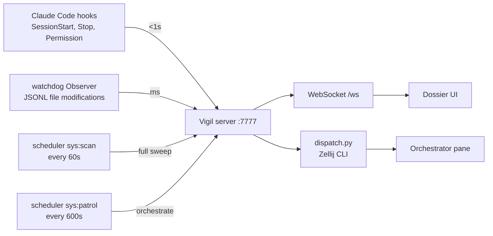

I built Vigil because I was running half a dozen Claude Code sessions in parallel across different projects and I kept losing the thread on which one was making progress, which was idle, and which had been waiting on me for an hour. Vigil is a localhost FastAPI plus WebSocket server on port 7777 that watches every Claude Code JSONL log on the machine, classifies each session into one of four states, sends a patrol message to a designated Orchestrator session every ten minutes, and writes activity digests so I can step away and come back without rebuilding context.

The problem with running many sessions is that each one is its own world. There is no shared status panel, no list of "who has been idle since when," and no log of how each session moved through plan, develop, audit. I either had to walk every Zellij pane manually or accept that some sessions would sit forgotten until I noticed. Vigil is the one place that knows where everything is and a clock that asks the question for me.

  

    

      <h3 class="vigil-mock__title">Vigil</h3>
      Session Monitor
    

    

      
<b>6</b>sessions

      
<b>2</b>alerts

      
<b>09:32</b>local

    

  

  

    

      

        capstone
        running
      

      
Integrating utilization weights into the solver loop. Two commits in the last patrol window.

      

        workflow: develop
        idle 0m
      

    

    

      

        EmailDigest
        idle
      

      
Finished classifier accuracy pass. Awaiting review of the new bucket weights.

      

        workflow: audit
        idle 14m · self-inspection sent
      

    

    

      

        ToiletAlarm
        waiting
      

      
Permission request to write Widget extension target. Confirm? (y/n).

      

        workflow: develop
        blocked on user input
      

    

    

      

        amigo_app
        blocked
      

      
Three consecutive Edit failures on capacitor.config.ts. Stuck in tool_use for 34 min.

      

        workflow: develop
        error_streak=3 · ALERT
      

    

    

      

        vigil
        idle
      

      
Refactored summarizer debounce. Idle since last patrol.

      

        workflow: simplify
        idle 6m
      

    

    

      

        Auto_Vid_Gen
        running
      

      
Rendering platform-tagged shorts. context: 760k tokens (WARN).

      

        workflow: e2e-test
        context_high
      

    

  

*FIG.01: the session dashboard. Each card is one Claude Code session detected by scanning `~/.claude/sessions/` and matching against Zellij panes. Status is one of four values; the chip color comes from the dossier palette so the panel reads as a status board, not a logging UI.*

The state model is small on purpose. Every session is exactly one of `running`, `idle`, `waiting`, `blocked`. `running` means the JSONL has a recent `tool_use` boundary or activity inside sixty seconds. `idle` means an `end_turn` boundary or sixty seconds of silence. `waiting` is what `screen_check.py` reports when a `dump-screen` of the pane matches a permission prompt or a confirm dialog. `blocked` is three consecutive tool failures, or stuck in `tool_use` for more than thirty minutes. The priority is `blocked > waiting > idle/running` so a session in trouble can never look healthy. Mode is a separate axis with two values: `monitored` is the default and read-only; `managed` lets Vigil auto-approve permission prompts and ping the Orchestrator when the session goes idle.

*FIG.02: four detection layers, one server. Hooks are authoritative push from Claude Code itself with a sub-second budget. Watchdog reads JSONL byte-deltas the moment a session writes. Scheduler `sys:scan` is the slow correctness pass that catches drift the first two layers miss. Scheduler `sys:patrol` is the only layer that calls a human-level decision out, by sending a `[PATROL]` message to the Orchestrator session.*

The four-layer detection model is the part that took the longest to get right. Watchdog alone is too noisy: Claude Code streams partial JSONL entries during a single assistant reply, and broadcasting on every byte-delta floods the UI. The scan layer alone is too slow: a sixty-second poll for a developer who is actively typing is a step backward from `tail -f`. So the watchdog handler in `watcher.py` keeps a per-file byte offset in a thread-safe dictionary, only emits a `session_update` when status actually changes or a turn closes, and hands the asyncio scheduling back to the main loop via `_loop.call_soon_threadsafe`. The scan job runs every sixty seconds and catches the gap cases: sessions that died without a hook, panes that drifted to a new ID after a Zellij restart, the Orchestrator's own JSONL which must be excluded from the monitoring list. The hook layer is the third piece. Claude Code fires `SessionStart`, `UserPromptSubmit`, `Stop` and `StopFailure` hooks that the local `vigil-hook.sh` script forwards to `/api/hook/{event}`, and an MCP channel server (`channel/vigil-channel.ts`, one per session) relays permission requests directly. In `managed` mode the channel returns `allow` in under a hundred milliseconds, replacing what used to be a sixty-second screen-check and regex match.

The Orchestrator is itself a Claude Code session. Its job is not to write project code; it reads `/api/sessions` and `/api/signals`, sets each project's `intent` via `PUT /api/intents/{project}`, decides whether to dispatch a self-inspection prompt to an idle pane, and writes a digest. The trigger is a `[PATROL]` message that the scheduler's `sys:patrol` job composes every six hundred seconds and `dispatch.py` writes into the Orchestrator's pane through `zellij action write-chars` followed by `send-keys Enter`. Dispatch verifies delivery by dumping the screen back and matching the message in the bottom twenty lines, retrying three times before reporting `verified=false`. The guardrail that mattered most was `POST /api/inspections/{project}` for self-inspections: idle sessions get one inspection prompt at the ten-minute mark, the result is recorded, and the next patrol does not double-dispatch.

  

    Activity Digest · 09:32
    DIGEST-2026-04-28-0932
  

  
capstone 完成了 solver 的 utilization 权重集成，两次 commit，目前 idle。

  
amigo_app 在 capacitor.config.ts 上连续三次 Edit 失败，已经 34 分钟卡在 tool_use，状态升为 blocked。建议人工介入或回滚最近一次 plan。

  
ToiletAlarm 等待权限确认中（写入 Widget extension target），需要用户回复 y/n。

  
Auto_Vid_Gen 上下文使用 760k tokens，已触发 context_high WARN，建议在下一个 turn 后 /compact。

  
其余项目无变化。

*FIG.03: an actual-shaped digest. The generator is a `claude -p` subprocess invoked by the `sys:digest` job every five minutes; its prompt forbids bullet points, "正在监控中" boilerplate, and "过去 X 分钟" openers, and requires it to read the previous digest first so this one only reports changes.*

The signal layer is mechanical on purpose. `signals.py` only detects three things: `stuck` when a `tool_use` has not closed in thirty minutes (`STUCK_THRESHOLD = 1800` seconds), `error_streak` when three or more consecutive tool calls fail, and `context_high` when total input tokens cross 750,000 (WARN) or 900,000 (ALERT) on the way to the one-million-token context window ceiling. Anything that needs judgment, like reading whether the latest commit message is honest or whether a planning document still matches the code, is not the signal layer's problem; the Orchestrator spawns an Agent for that on the next patrol.

The piece that turned out to matter most was a separation I almost skipped. Summary generation runs inside Vigil itself via a non-interactive `claude -p` call with a ten-second debounce and a maximum of two concurrent subprocesses, and the subprocess `cwd` is forced to `/tmp` so it does not pollute the monitored project's JSONL stream. Strategic decisions stay with the Orchestrator. Mixing the two makes the Orchestrator slow and verbose; splitting them keeps the human-facing digest short and the per-session summaries fresh.

After three weeks of continuous use Vigil has been monitoring six to eight sessions in parallel without losing track of any of them. The four-state model is small enough to glance at and large enough to catch the cases that matter. The patrol loop turned the question "what is each session doing right now" into a single open browser tab, and the digest turned "what happened while I was away" into a paragraph I can read in thirty seconds.
