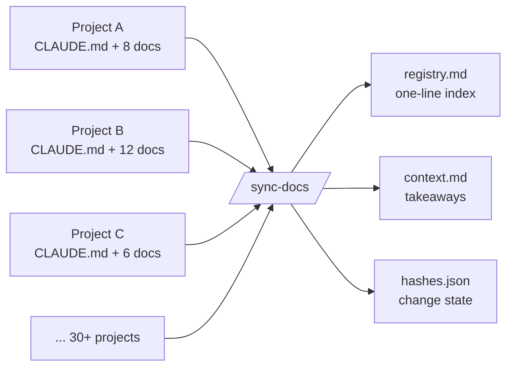
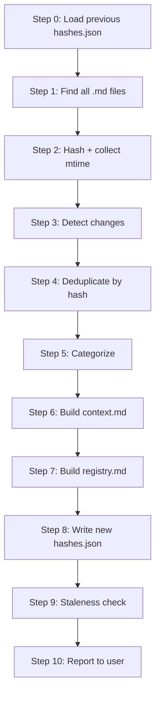
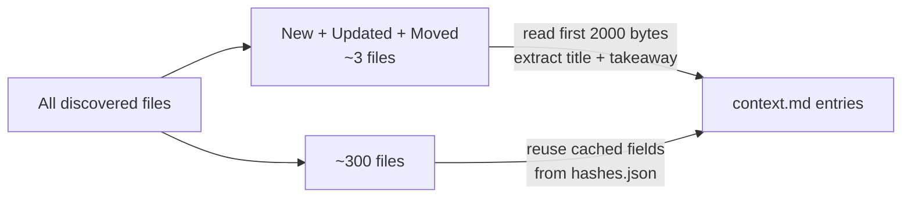

# Designing `/sync-docs`: A Cross-Project Knowledge Base for Claude Code

Across 30+ side projects, I had accumulated 330 markdown files: a `CLAUDE.md` in every repo, half-finished specs, incident reports, design notes, pitfall logs. When I needed to recall something ("how did I solve that PostgreSQL enum migration?"), I would grep across `~/Downloads/` and usually give up.

So I built a Claude Code slash command to fix it. `/sync-docs` is 260 lines of Markdown-as-prompt at `~/.claude/commands/sync-docs.md`. This post covers the design: what I chose to deduplicate, how I decide a canonical copy, why `context.md` is capped at 2000 lines, why staleness is 90 days.

---

## 1. The Problem

Every project starts with a `CLAUDE.md`. Most end up with `ARCHITECTURE.md`, a few specs, a couple of incident writeups, and if I am lucky, an `experience/` folder with the bugs I want to remember.

Those docs are trapped inside the project that created them. When I start a new project and hit a similar problem, I do not remember which repo has the relevant note. I re-solve the problem, then write another note that future-me will also fail to find.

The requirements I wrote down:

- A single index I can scan across all projects.
- Duplicate detection, since the same file often gets copied between repos.
- A way to flag files that are stale and should be deleted.
- An output I can paste into a Claude session as cross-project memory.

The last requirement shaped the rest of the design.



---

## 2. Three Output Files, One Per Reader

The skill writes three files to `~/Downloads/claude-knowledge/`.

| File | Purpose | Size |
|------|---------|------|
| `registry.md` | One-line-per-file index, grouped by category | ~420 lines |
| `context.md` | 2 to 5 line takeaway per unique file, grouped by category | capped at 2000 lines |
| `hashes.json` | File hashes plus cached titles and takeaways for incremental runs | ~60 KB |

Each file is optimized for a different reader. `registry.md` is human-scannable table of contents. `context.md` is what I paste into Claude as memory. `hashes.json` is the state file that makes the next run fast.

Splitting into three means each reader skips the content they do not need.

---

## 3. The 10-Step Pipeline



The pivotal step is Step 0. Loading the previous `hashes.json` before anything else is what makes the skill incremental. Step 6 (building `context.md`) is where the LLM cost lives, since each file gets read and summarized. If that ran on every file every time, each re-scan would cost thousands of tokens.

Instead, Step 3 partitions files into new, updated, moved, deleted, and unchanged. Only the first three need re-reading. Unchanged files reuse the cached `title` and `takeaway` fields stored in the previous `hashes.json`.

The key design decision: cache the output of the LLM read inside `hashes.json`, not just the hash. That turns a scan of 300 files from "a few minutes" into "a few seconds when nothing changed."

---

## 4. The Exclude List

The `find` command looks simple, but the exclude list took several rounds of tuning.

```bash
find ~/Downloads -name "*.md" -type f \
  -not -path "*/node_modules/*" \
  -not -path "*/.venv/*" \
  -not -path "*/.git/*" \
  -not -path "*/dist/*" \
  -not -path "*/build/*" \
  -not -path "*/.cache/*" \
  -not -path "*/__pycache__/*" \
  -not -path "*/.expo/*" \
  -not -path "*/.specify/templates/*" \
  -not -path "*/claude-knowledge/*" \
  -not -name "LICENSE.md"
```

Without `node_modules` and `.venv`, a single Electron project would drown the index in 20,000 package READMEs.

The critical one was `claude-knowledge/*`. Without it, the skill scans its own output on the second run. `context.md` appears as a new file, gets re-read, gets re-added to the next `context.md`, which gets re-read next time. I caught the recursive self-indexing on run two.

The `.specify/templates/*` exclude filters out boilerplate template files that appear in every `specify`-initialized project. Same content in every repo, zero signal.

---

## 5. Change Detection With a Fifth Case

Comparing new hashes against previous hashes gives four obvious partitions:

- **New**: path exists now, not before.
- **Updated**: path in both, hash changed.
- **Deleted**: path before, not now.
- **Unchanged**: same path, same hash.

Those four fail when I rename a directory. Every file looks like a delete plus new pair, and the whole batch gets re-read despite identical content.

I added a fifth case:

> **Moved**: path A deleted AND path B new AND same filename AND same hash.

When detected, the skill reuses the cached takeaway and updates the path only. On my last run, 3 files were detected as moved, all from an `Auto_Vid_Gen/` to `CM-social-platforms/` reorganization. Without the moved case, those would have been full re-reads for no reason.

The match rule is intentionally strict (filename AND hash). A file with a new name or new content does not qualify, because then it genuinely should be re-read.

---

## 6. Picking a Canonical Copy

The registry currently shows 18 duplicate sets: files with identical hashes appearing in multiple projects. Example:

```
Canonical: Pixel_video/experience/01-dispatchqueue-asyncafter-breaks-swiftui-timing.md
Aliases:   couple_rate/docs/experience/01-dispatchqueue-asyncafter-breaks-swiftui-timing.md
```

These were not duplicated by accident. `couple_rate` is a branded version of `Pixel_video`, and the `experience/` folder was intentionally shared. But the knowledge base does not need two entries. The question: which copy is canonical?

The rule, checked top to bottom:

1. Prefer files in a project that has a `CLAUDE.md` at the root (signals an active project).
2. Prefer shorter paths.
3. Prefer files in a `docs/` subdirectory.

The ordering is deliberate. Rule 1 filters out dead projects. If a repo has no `CLAUDE.md`, the project is probably abandoned and its copies should not become canonical. Rule 2 is a proxy for "closer to the project root," which usually means more intentional placement. Rule 3 is the tiebreaker that prefers `docs/foo.md` over `notes/foo.md`.

Aliases still appear in `hashes.json` with `"canonical": false, "alias_of": "..."`, so alias paths can be resolved back to canonical when needed. Aliases do not appear in `context.md`: the takeaway is written once.

**Same filename with different content is NOT a duplicate.** My scan has 14 different `CLAUDE.md` files, one per project, all with unique content. Collapsing those as duplicates would destroy the most valuable kind of diversity in the knowledge base. The skill detects this case separately and surfaces it under "Same-Name Files":

```
| CLAUDE.md | Auto_Vid_Gen, CM-social-platforms, EmailDigest, Personal_Development,
             Pixel_video, ToiletAlarm, Training, amigo_app, capstone, clawapp,
             clawapp_frontend, prompt_injection_blocker, vigil, vioceClone |
```

The count of unique `CLAUDE.md` files is essentially "how many active projects do I have."

---

## 7. Categories and Their Order

Each unique file gets exactly one category. Rules are checked top to bottom, first match wins.

| Category | Rule |
|----------|------|
| Engineering Lessons | Path has `experience/`, or name matches `*bugs*`, `*lessons*`, `*pitfalls*` |
| Architecture | Path has `architecture/`, or name matches `*ARCHITECTURE*`, `*-design*` |
| Product Specs | Path has `specs/`, or name matches `*PRD*`, `*spec*`, `*usecase*`, `*journey*`, `*Product*` |
| Security | Name matches `*security*`, `*audit*`, `*SECURITY*` |
| Dev Guides | Name is `CLAUDE.md`, `DEV_GUIDE*`, `INITIALIZE*`, `development.md`, `SERVER.md` |
| Planning | Path has `planning/`, or name matches `*ROADMAP*`, `*PROGRESS*`, `*plan*` |
| Project Config | Name is `SKILL.md`, `COMMAND.md` |
| Other | Everything else |

Engineering Lessons is first on purpose. That is the category I re-read most, since that is where the debugging stories live. Putting it first means a file like `spec-experience.md` gets caught by the `experience/` path rule before it can land in Product Specs.

Ordering mattered more than I expected. On the first pass I had Dev Guides before Product Specs, and `spec-kit.md` landed in Dev Guides due to `CLAUDE.md` similarity. I fixed it by bumping Product Specs higher. General principle: more specific rules go first, where "more specific" means either a path segment (like `experience/`) or a filename with strong priors (like `PRD`).

---

## 8. The 2000-Line Cap on `context.md`

For each new, updated, or moved file in Step 6, the LLM reads the first 2000 characters and extracts the title plus a 2 to 5 line takeaway. Unchanged files reuse the cached fields. That is how every run after the first stays cheap.



The hard cap: `context.md` must stay under 2000 lines. If it exceeds:

1. Drop "Other" entries first.
2. Then drop "Project Config" entries.
3. Then truncate remaining entries to title plus takeaway only, stripping metadata.

Why 2000? The whole point of `context.md` is that it can be pasted into a fresh Claude session as cross-project memory. If it is too big to fit comfortably in a prompt, the artifact has failed its job. 2000 lines is roughly 50 to 80K tokens depending on density, which fits any modern context window while leaving room for actual conversation.

The drop order is a judgment call about what to miss least. "Other" holds files the categorizer could not classify, usually low signal. "Project Config" is `SKILL.md` files, reproducible from the skill files themselves. Real lessons and architecture stay.

---

## 9. Why 90 Days for Staleness

Step 9 uses the mtime collected in Step 2. Any file not modified in 90+ days gets flagged.

```
### Stale Files (not modified in 90+ days)

| File | Project | Last Modified | Days Stale |
|------|---------|---------------|------------|
| orchestrator-plan.md | clawapp | 2025-11-03 | 165 |
| adsfasf.md | datamanagement | 2025-09-18 | 211 |
```

I tried 60 and 180. 60 days fired on too many docs I was still actively referencing. 180 days missed things that had obviously rotted. 90 days is roughly one quarter of side-project time: long enough to be confident a doc is dormant, short enough to catch rot before it compounds.

The skill does not delete anything. It reports. Stale docs are worse than no docs, since they mislead future-me into thinking something is still true, so the signal is valuable. But the deletion decision has to be mine. Some flagged files turn out to be perfectly fine reference material I have not touched. Others get removed.

---

## 10. How I Use It

I run `/sync-docs` every few days, usually before starting a new project or when I notice I am about to re-solve something. What I have gotten from it:

- **Planned a month of blog posts** by scanning `registry.md` grouped by project. The post you are reading is Week 1 of that plan.
- **Found 18 duplicate sets** I did not know existed. Three were stale copies of active files that had drifted without my knowledge.
- **Counted 14 active projects** from the `CLAUDE.md` same-name analysis.
- **Detected 3 moved files** from a recent directory reorganization, confirming nothing was lost.
- **Pasted `context.md` into new Claude sessions as memory.** This is the most frequent use, and the reason I designed the whole thing.

The last point is the core use case. When a fresh Claude session asks "how have you solved X before?", I have one file to paste. Not 311 files. Not "grep through `~/Downloads`." One file, capped at 2000 lines, full of takeaways I have already written. That is the real output: scattered notes turned into cross-session memory for the agent.

---

## 11. Prompt as Code

The full skill is 260 lines of Markdown at `~/.claude/commands/sync-docs.md`. There is no Python, no compiled binary. It is a prompt, structured into 10 steps, with exact rules for each step. Claude reads it and executes it.

A well-structured prompt is code. The value is not in the bash snippets embedded in the skill, which are trivial. The value is in the decisions: which paths to exclude, which categories to use, how to resolve canonical duplicates, where to cap the output, what the dropout order is when the cap is exceeded, how to distinguish "moved" from "delete plus new." Each of those was a judgment call. None are obvious in advance. Most I got wrong on the first try and tuned by running the skill on my actual file tree and inspecting the output.

The skill is portable because it is a file. The design is portable because it is written down. Treating prompt-authoring as engineering, with versioned decisions and tight tests (run it, inspect the output), produces something reusable and improvable.

---

## Summary

With more than a handful of projects, markdown docs rot. `/sync-docs` reports what exists, what is duplicated, what is stale, and what keeps getting re-solved. The algorithm is 10 steps. The output is three files. Most of the work was picking the right defaults.

Next post: SwiftUI animation, 7 bugs from a weekend iOS project. The raw material was already in `Pixel_video/experience/`, but I only knew it was there because the skill surfaced it.
