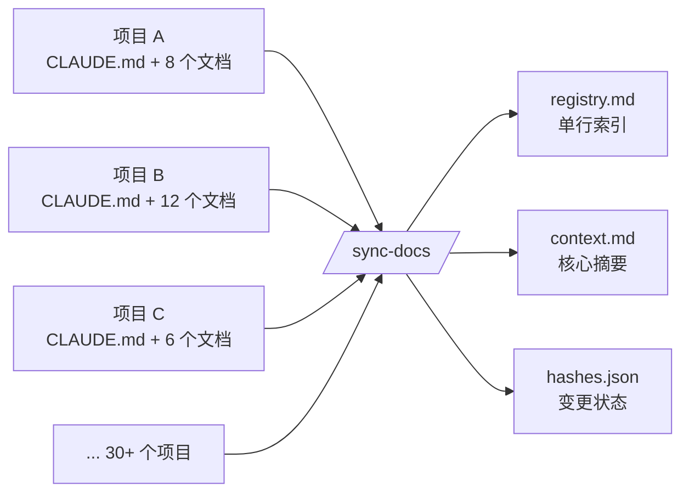
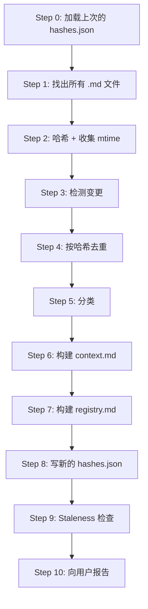
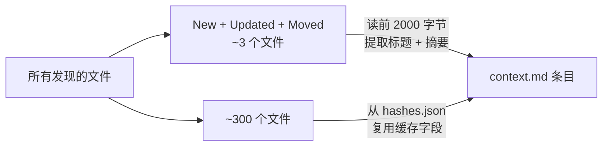

# 设计 `/sync-docs`：给 Claude Code 做一个跨项目知识库

我手上有 30+ 个 side project，这些年下来攒了 330 个 markdown 文件：每个仓库都有 `CLAUDE.md`，半成品 spec、事故报告、设计笔记、踩坑记录。每次我要翻点什么（"那个 PostgreSQL enum 迁移我当时是怎么解决的？"），就在 `~/Downloads/` 里瞎 grep，一般最后都放弃。

于是我写了一个 Claude Code 的 slash command 来解决它。`/sync-docs` 是 260 行 Markdown-as-prompt，放在 `~/.claude/commands/sync-docs.md`。这篇写的是设计过程：去重规则怎么定、canonical 文件怎么选、为什么 `context.md` 封顶 2000 行、为什么 staleness 阈值定在 90 天。

---

## 1. 要解决的问题

每个项目都从一个 `CLAUDE.md` 开始。大多数最后会多出 `ARCHITECTURE.md`、几个 spec、一两篇事故复盘，运气好的话还有一个 `experience/` 目录存着我想记住的 bug。

问题在于：这些文档被锁在各自的项目里。我开新项目遇到类似问题的时候，根本想不起哪个仓库有相关笔记。于是重新解一次，再写一个笔记，未来的我同样找不到。

我把需求列了一遍：

- 一个能跨所有项目扫的索引。
- 去重能力，因为同一个文件经常被复制到多个仓库。
- 能标出过期的文件，提示我删。
- 一个能直接粘到 Claude session 里当跨项目记忆的输出。

最后一条决定了其他所有设计。



---

## 2. 三个输出文件，每个服务一类读者

最终产物是 `~/Downloads/claude-knowledge/` 下的三个文件。

| 文件 | 用途 | 体积 |
|------|---------|------|
| `registry.md` | 每文件一行的索引，按分类分组 | ~420 行 |
| `context.md` | 每个唯一文件 2 到 5 行摘要，按分类分组 | 封顶 2000 行 |
| `hashes.json` | 文件哈希 + 缓存的标题和摘要，用于增量运行 | ~60 KB |

每个文件服务一个不同的读者。`registry.md` 给人看，是可扫读的目录。`context.md` 给 Claude 看，粘到 session 里当记忆。`hashes.json` 给 skill 自己下次运行用，是让后续扫描变快的 state 文件。

拆成三个的好处：每个读者都能跳过自己不需要的内容。

---

## 3. 十步流水线



关键是 Step 0。先加载上一次的 `hashes.json`，是整个 skill 能做到增量的前提。Step 6（构建 `context.md`）是 LLM 成本所在：每个文件都要读一遍再摘要。如果每次都对所有文件跑这一步，单次重扫就要烧掉上千 token、跑好几分钟。

所以 Step 3 做了一个五分类：new、updated、moved、deleted、unchanged。只有前三类需要重新读。unchanged 的文件直接复用上次 `hashes.json` 里缓存的 `title` 和 `takeaway` 字段。

这里的关键设计决策：把 LLM 读取的产出也缓存进 `hashes.json`，而不只是缓存哈希。这让一次 300 文件的扫描从"几分钟"变成"没改动时几秒钟"。

---

## 4. 排除列表

`find` 命令看起来简单，但排除列表调了好几轮。

```bash
find ~/Downloads -name "*.md" -type f \
  -not -path "*/node_modules/*" \
  -not -path "*/.venv/*" \
  -not -path "*/.git/*" \
  -not -path "*/dist/*" \
  -not -path "*/build/*" \
  -not -path "*/.cache/*" \
  -not -path "*/__pycache__/*" \
  -not -path "*/.expo/*" \
  -not -path "*/.specify/templates/*" \
  -not -path "*/claude-knowledge/*" \
  -not -name "LICENSE.md"
```

没有 `node_modules` 和 `.venv` 的话，一个 Electron 项目就能往索引里灌 20,000 个我根本不关心的 package README。

最关键的是 `claude-knowledge/*`。没有它，skill 第二次运行会扫到它自己的输出：`context.md` 变成一个新文件，被重新读、被再次加进下一个 `context.md`，下次又被读一遍。我在第二次运行就发现了这种递归自索引。

`.specify/templates/*` 过滤的是另一类噪音：每个 `specify` 初始化的项目里都存在的模板文件，每个仓库内容都一样，零信号。

---

## 5. 加上"Moved"这第五种状态

拿新哈希和旧哈希对比，四种划分是最直接的：

- **New**：现在有、之前没有的路径。
- **Updated**：路径两边都有，但哈希变了。
- **Deleted**：之前有、现在没有的路径。
- **Unchanged**：路径一样、哈希一样。

但我要是重命名了目录，这四种就会出问题。每个文件都会被识别成 delete + new 对，内容明明一样却要整批重读。

所以我加了第五种：

> **Moved**：路径 A 被删 **且** 路径 B 新增 **且** 文件名相同 **且** 哈希相同。

命中之后，复用缓存 takeaway，只更新路径。上次跑的时候检测到 3 个 moved，全来自我上周把 `Auto_Vid_Gen/` 重组到 `CM-social-platforms/` 的目录调整。没有 moved 判断，这 3 个文件会被白白重读一遍。

匹配规则特意做严格（文件名 **且** 哈希）。文件名变了或内容变了都不算 moved，因为那时候的确应该重读。

---

## 6. Canonical 文件怎么挑

registry 里现在有 18 个重复集合：哈希相同但在多个项目里出现的文件。比如：

```
Canonical: Pixel_video/experience/01-dispatchqueue-asyncafter-breaks-swiftui-timing.md
Aliases:   couple_rate/docs/experience/01-dispatchqueue-asyncafter-breaks-swiftui-timing.md
```

这些不是误操作复制。`couple_rate` 是 `Pixel_video` 的换皮版本，`experience/` 目录是故意共享的。但知识库不需要两份条目。问题变成：哪一份算"正本"？

我最后定的规则，从上往下检查：

1. 优先根目录下有 `CLAUDE.md` 的项目里的文件（说明项目还活着）。
2. 优先路径更短的。
3. 优先位于 `docs/` 子目录下的。

顺序是刻意的。规则 1 把死项目过滤掉：一个仓库连 `CLAUDE.md` 都没有，多半已经被我放弃，它里面的副本不该当正本。规则 2 是"离项目根更近"的代理指标，通常意味着更有意。规则 3 是 tiebreaker，`docs/foo.md` 比 `notes/foo.md` 优先。

别名依然出现在 `hashes.json` 里，带 `"canonical": false, "alias_of": "..."`，所以需要反查正本时数据还在。但别名不进 `context.md`：摘要只写一次。

**同文件名、不同内容，不算重复。** 我这次扫到 14 份不同的 `CLAUDE.md`，每个项目一个，内容全不一样。如果当重复处理掉，我就销毁了知识库里最有价值的一种多样性。所以 skill 单独处理这种情况，在 "Same-Name Files" 段落里呈现：

```
| CLAUDE.md | Auto_Vid_Gen, CM-social-platforms, EmailDigest, Personal_Development,
             Pixel_video, ToiletAlarm, Training, amigo_app, capstone, clawapp,
             clawapp_frontend, prompt_injection_blocker, vigil, vioceClone |
```

唯一 `CLAUDE.md` 的数量本质上就等于"我有几个活跃项目"。

---

## 7. 分类和它们的顺序

每个唯一文件分到一个类别。规则从上到下检查，第一个命中的赢。

| 类别 | 规则 |
|----------|------|
| Engineering Lessons | 路径含 `experience/`，或文件名匹配 `*bugs*`、`*lessons*`、`*pitfalls*` |
| Architecture | 路径含 `architecture/`，或文件名匹配 `*ARCHITECTURE*`、`*-design*` |
| Product Specs | 路径含 `specs/`，或文件名匹配 `*PRD*`、`*spec*`、`*usecase*`、`*journey*`、`*Product*` |
| Security | 文件名匹配 `*security*`、`*audit*`、`*SECURITY*` |
| Dev Guides | 文件名是 `CLAUDE.md`、`DEV_GUIDE*`、`INITIALIZE*`、`development.md`、`SERVER.md` |
| Planning | 路径含 `planning/`，或文件名匹配 `*ROADMAP*`、`*PROGRESS*`、`*plan*` |
| Project Config | 文件名是 `SKILL.md`、`COMMAND.md` |
| Other | 以上都不是 |

Engineering Lessons 放第一位是故意的。这是我重读最频繁的类别，debugging 故事都在这。放第一位意味着 `spec-experience.md` 这种文件会先被 `experience/` 路径规则抓住，不会误落到 Product Specs。

顺序比我预想的更关键。第一版我把 Dev Guides 放在 Product Specs 前面，结果 `spec-kit.md` 因为 `CLAUDE.md` 气息太浓，掉进了 Dev Guides。我把 Product Specs 往上提就修好了。一般原则：更具体的规则先走，"更具体"指的是有路径片段（像 `experience/`）或者强先验的文件名（像 `PRD`）。

---

## 8. `context.md` 的 2000 行封顶

Step 6 里，对每个 new / updated / moved 的文件，LLM 读前 2000 字符，提取标题和 2 到 5 行摘要。unchanged 的文件复用缓存。这是第一次之后每一次都便宜的原因。



硬性约束：`context.md` 必须在 2000 行以内。超出的话：

1. 先扔 "Other" 类别。
2. 再扔 "Project Config" 类别。
3. 还不够就把剩下的条目砍成只剩标题 + 摘要，去掉 metadata。

为什么是 2000？因为 `context.md` 存在的全部意义就是能塞进一个新的 Claude session 当跨项目记忆。如果它塞不进 prompt，这个产物就失败了。2000 行按密度大概是 50 到 80K token，任何现代 context window 都装得下，还留出实际对话的空间。

丢弃顺序是我的判断：扔掉哪部分最不心疼。"Other" 是分类器归不了类的，一般信号低。"Project Config" 是 `SKILL.md` 文件，skill 本身就能重建摘要。真正的 lesson 和 architecture 留下。

---

## 9. 为什么 Staleness 定在 90 天

Step 9 用 Step 2 收集的 mtime。90+ 天没改动的文件被标记。

```
### Stale Files (not modified in 90+ days)

| File | Project | Last Modified | Days Stale |
|------|---------|---------------|------------|
| orchestrator-plan.md | clawapp | 2025-11-03 | 165 |
| adsfasf.md | datamanagement | 2025-09-18 | 211 |
```

我试过 60 天和 180 天。60 天触发的文件太多，很多我还在频繁引用。180 天又漏掉一些明显已经腐烂的。90 天大约是"一个 side project 季度"的量级：足够长，能有把握判断文档已经不活跃；足够短，能在腐烂复利之前抓到。

Skill 不做任何删除，只报告。过期文档比没文档更糟，因为它们会误导未来的我以为某件事还成立。但删不删只能我自己定。有些被标出来的文件仔细一看还是有用的参考资料，只是我没动过；另一些就顺手干掉了。

---

## 10. 我怎么用它

我每隔几天跑一次 `/sync-docs`，一般是在开新项目前，或者我察觉到自己又要重复解决某个问题时。到目前为止这个 skill 给了我：

- **排出了一个月的博客计划**，通过按项目分组扫 `registry.md`。你正在读的就是这个计划的第 1 周。
- **找到 18 组我不知道存在的重复**。其中 3 组是已经漂移的旧副本。
- **数出 14 个活跃项目**，通过 `CLAUDE.md` 同名分析。
- **检测到 3 个 moved 文件**，来自最近的目录重组，确认没有东西在搬家过程中丢掉。
- **把 `context.md` 粘进新 Claude session 当记忆**。这是我用得最频繁的，也是我当初设计整个 skill 的出发点。

最后一点是核心用例。新 session 问"你以前是怎么解决 X 的？"的时候，我有一个文件可以粘，不是 311 个文件，不是"自己去 `~/Downloads` grep"。一个文件，封顶 2000 行，里面全是我自己写的摘要。这就是真正的产出：把散落的笔记变成 agent 的跨 session 记忆。

---

## 11. Prompt 即代码

整个 skill 是 `~/.claude/commands/sync-docs.md` 里的 260 行 Markdown。没有 Python，没有编译产物。它就是一个 prompt，结构化成 10 步，每一步都有明确规则。Claude 读它，然后执行。

一个结构良好的 prompt 就是代码。价值不在里面嵌的几行 bash（那些很平凡），价值在一个个决策：该排除哪些路径、用哪些分类、怎么选 canonical、在哪里封顶、封顶之后按什么顺序丢弃、"moved"和"delete + new"怎么区分。每一条都是 judgment call，没有一条是一眼就能对的。大多数我第一版都做错了，靠在自己真实的文件树上跑一遍、看输出，才一步步调对。

Skill 本身是可迁移的，因为它就是一个文件。设计是可迁移的，因为它被写下来了。把 prompt-authoring 当工程对待（带版本化决策、带扎实的测试：跑一下、看输出），做出来的东西可以复用、可以演化。

---

## 小结

只要项目数超过一小把，markdown 文档就开始腐烂。`/sync-docs` 报告我手里有什么、哪些重复了、哪些过期了、哪些问题我在反复解。算法是 10 步，输出是 3 个文件。真正花时间的是挑对默认值。

下一篇：SwiftUI 动画，周末 iOS 项目踩的 7 个坑。原料早就在 `Pixel_video/experience/` 里了，我能知道它们还在是因为这个 skill 把它们捞出来了。
