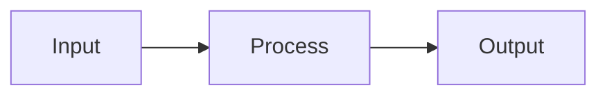

# Feature Specification: Project Detail Pages

**Feature Branch**: `001-personal-site`
**Created**: 2026-04-26
**Status**: Shipped (template + 1 fully realized example + 3 stubs)
**Input**: User asked for project detail pages that (a) take design cues from juliakrantz.com's editorial catalog model but (b) are improved for code/AI projects (which need diagrams, code blocks, terminal output, and metrics: not photo galleries). Must support mermaid + code highlighting. The bento cards on the home page link to these detail pages instead of jumping straight to GitHub.

## Design Purpose

The home-page bento mosaic answers "what are the projects?" The detail pages answer "what did each one do, and how?" The goal is an engineering-grade case-study pattern that stays editorial: single column, narrative-led, no marketing chrome. The reference reading is Stripe customer stories + Vercel case studies + Linear changelog entries + Anthropic research papers: restrained typography, single-column body, artifacts placed with intent. The tone is *technical peer*, not pitch deck.

Specific decisions:

1. **No body H1/H2 for the project name.** The page title (rendered from `projects.json`) is the H1. Markdown body is treated as one continuous read with optional H2/H3 only when the case-study truly has multiple distinct phases.
2. **`FIG.NN: caption` after every artifact.** Inspired by juliakrantz's catalog and Anthropic's "Figure 1:" convention. Achieved with markdown italics on their own line: `*FIG.01: caption*`. CSS upgrades these into uppercase mono captions.
3. **Pygments code highlighting via `codehilite`** (already in `md_to_body.py`). Pygments emits semantic CSS classes (`.k`, `.s`, `.c`, etc.); the project-detail stylesheet defines a custom dark theme over those classes (cyan keywords, amber strings, dim italic comments) matching the site's tokens. Zero JS bundle cost.
4. **Mermaid diagrams use the site's cyan accent.** Theme variables override defaults so diagrams read as native to the site, not pasted in.
5. **Foot navigation = adjacent project prev/next + back-to-home.** No sidebar of all projects (overkill at 4); no marketing CTA at the end.
6. **One feathered translucent panel** per page, echoing the home-page bento's container so the section feels like a continuation of the same surface.

---

## User Scenarios & Testing

### User Story 1: Read a project's case study (Priority: P1)

A visitor clicks a bento card on the home page, lands on the project detail page, and reads the full case study without leaving the page. The page tells them what the project is, why it exists, how it works, and what shipped.

**Acceptance Scenarios**:
1. **Given** a visitor on the home page, **When** they click a project bento card, **Then** the URL navigates to `/projects/<slug>/` and the detail page renders with: breadcrumb (`PROJECTS · 01 / SK · 2025`), title, optional LIVE badge, tagline, metadata table (Year, Stack, Code, Source/Live links), summary paragraph, body content, foot navigation.
2. **Given** the body markdown contains a ```` ```mermaid ```` block, **When** the page loads, **Then** mermaid lazy-initializes with the dark + cyan theme and renders the diagram inside a styled card.
3. **Given** the body contains code blocks, **When** the page renders, **Then** Pygments classes are styled with cyan keywords, amber strings, dim italic comments: no raw VS-Code-style colors, no line numbers by default.
4. **Given** the body contains italic text on its own line (`*FIG.01: ...*`), **When** rendered, **Then** the italic appears as an uppercase mono caption in the muted token color.

### User Story 2: Navigate between adjacent projects (Priority: P2)

The reader finishes a project and wants to read the next one without going back to the home page.

**Acceptance Scenarios**:
1. **Given** the reader is on the second project's detail page, **When** they reach the foot of the page, **Then** they see a `Previous: Project A` card on the left and a `Next: Project C` card on the right, each linking to `/projects/<slug>/`.
2. **Given** the reader is on the first project, **Then** the prev slot is empty (no card); **When** on the last, **Then** the next slot is empty.

### User Story 3: Read in zh (Priority: P2)

The detail page honors the locale toggle.

**Acceptance Scenarios**:
1. **Given** locale is `zh` and `content/projects/<slug>.zh.md` exists, **When** the page loads, **Then** the body fetches `body.zh.html`; metadata labels and foot-nav strings render in Chinese.
2. **Given** `<slug>.zh.md` does not exist, **When** locale is `zh`, **Then** the page falls back to `body.html` while keeping the i18n labels in zh: no broken state.

### User Story 4: Stay readable on mobile (Priority: P2)

Small screens collapse the meta table to compact rows, stack the foot nav, and shrink code blocks.

**Acceptance Scenarios**:
1. **Given** a viewport ≤640px, **When** the page renders, **Then** title font scales down via `clamp()`, the metadata `dt`/`dd` columns narrow, and prev/next stack vertically.

### Edge Cases

- **Missing markdown body**: page renders header + metadata + summary; body section is empty. No fatal error.
- **Slug not found in projects.json**: 404 view (`project-detail--not-found`) with link back to home.
- **Mermaid syntax error**: mermaid logs a warning; page renders the rest. Author should validate diagrams in dev before shipping.

---

## Requirements

### Functional Requirements

#### Routing & data
- **FR-PD-001**: Each project gets its own static MPA route at `/projects/<slug>/index.html`, with all 4 routes registered in `vite.config.ts` rollupOptions.input.
- **FR-PD-002**: The renderer (`src/project-detail.ts`) extracts the slug from `window.location.pathname`, looks up the project in `projects.json`, fetches `/projects/<slug>/body.html` (or `body.zh.html` if locale is zh and the file exists), and renders the article.
- **FR-PD-003**: The renderer computes `prev` and `next` from the array order in `projects.json` and renders foot-navigation cards accordingly.

#### Content authoring
- **FR-PD-004**: Body content lives at `content/projects/<slug>.md` (English) and optionally `content/projects/<slug>.zh.md` (Chinese). Markdown supports: paragraphs, ```` ```mermaid ````, ```` ```<lang> ```` code blocks, ordered/unordered lists, tables, blockquotes, inline `code`, headings.
- **FR-PD-005**: A template at `content/projects/_TEMPLATE.md` documents the convention: lede paragraph, problem paragraph, ≥1 mermaid diagram, 2–4 code blocks, FIG.NN captions, outcome paragraph. Length target 600–1000 words.
- **FR-PD-006**: `*FIG.NN: caption text*` on its own line renders as an uppercase mono caption beneath the preceding artifact (mermaid / code / image). This is achieved via a CSS rule on `.project-detail__body p > em:only-child`.

#### Visual treatment
- **FR-PD-007**: Page is single-column with `max-width: 46rem` (≈ 736px) on `.project-detail-page`.
- **FR-PD-008**: A feathered translucent panel sits behind the article (`::before`, `inset: -16px -32px`, `filter: blur(28px)`, bg `rgba(10, 10, 10, 0.55)`).
- **FR-PD-009**: Code blocks use Pygments' `.highlight` semantic classes restyled to: cyan keywords (`.k`, `.kt`), amber strings (`.s`, `.s1`, `.s2`), dim italic comments (`.c`, `.c1`), violet function/class names (`.nf`, `.nc`), pink numbers (`.mi`), red error tokens (`.err`).
- **FR-PD-010**: Mermaid diagrams initialize with theme variables matching the site palette (cyan line color `#22d3ee`, near-black `mainBkg`, transparent background).
- **FR-PD-011**: Inline metadata renders as a definition list (`<dl>`) with bordered top/bottom rules, mono uppercase keys, and `code` styling for the project code abbreviation.
- **FR-PD-012**: Foot navigation cards (prev / next) use a 2-column grid on desktop, stacked on mobile, with hover state lifting border to cyan.

#### Internationalization
- **FR-PD-013**: i18n keys `projects.detail.year`, `projects.detail.stack`, `projects.detail.code`, `projects.detail.repo`, `projects.detail.live`, `projects.detail.prev`, `projects.detail.next`, `projects.detail.backHome`, `projects.detail.navAria` exist for `en` + `zh`.

#### Generation pipeline
- **FR-PD-014**: `scripts/generate_projects.py` is idempotent. For each project in `projects.json` it: compiles `<slug>.md` + `<slug>.zh.md` to `public/projects/<slug>/body{,.zh}.html` via `md_to_body.py`; ensures `projects/<slug>/index.html` exists; ensures the `project-<slug>` rollup input is registered in `vite.config.ts`.
- **FR-PD-015**: The script does NOT overwrite existing `index.html` shells (so per-project meta tags stay author-edited).

#### Bento integration
- **FR-PD-016**: Bento project cards on the home page link to `/projects/<slug>/` (internal), not to `githubUrl`/`liveUrl` directly. The `↗` external arrow becomes `→` internal.

---

## Key Entities

### ProjectDetailContent (new: file system entity)
- **Source**: `content/projects/<slug>.md` (and optional `<slug>.zh.md`)
- **Structure**: lede paragraph → problem paragraph → 1+ mermaid diagram(s) → 2–4 code blocks → FIG captions throughout → outcome paragraph
- **Validation**: `slug` must match an `id` in `projects.json`; mermaid must be syntactically valid; code-block fence languages must be Pygments-recognizable
- **Generated artifacts**: `public/projects/<slug>/body.html` and `body.zh.html` (HTML-converted body); `projects/<slug>/index.html` (route shell)

### Existing entities touched
- **ProjectItem**: now drives `prev`/`next` ordering. Fields used: `id`, `title`, `tagline`, `tagline_zh`, `summary`, `summary_zh`, `tags` (rendered as Stack), `code`, `year`, `githubUrl`, `liveUrl`, `featured`. See [data-model.md](./data-model.md).

---

## Success Criteria

- **SC-PD-001**: A user clicking any of the 4 bento cards lands on a populated detail page with title + metadata + body in 100% of cases.
- **SC-PD-002**: Mermaid diagrams render with the site's theme (cyan, dark): not the default purple.
- **SC-PD-003**: Code blocks show cyan keywords + amber strings + dim italic comments. No flash-of-default-styling.
- **SC-PD-004**: Page passes axe-core a11y audit on `[data-section]`-equivalent (the `.project-detail` article).
- **SC-PD-005**: zh visitors see Chinese metadata labels + zh body when available; falls back to en body cleanly when `.zh.md` is absent.
- **SC-PD-006**: `python3 scripts/generate_projects.py` is safe to run repeatedly. Run from a clean checkout of just markdown files, the script reproduces the entire `public/projects/` and `projects/` tree without manual editing.

---

## Authoring Guide (使用方式)

### Adding a new project

1. **Add the project entry to `src/data/projects.json`** with all required fields (`id`, `code`, `title`, `tagline`, `tagline_zh`, `summary`, `summary_zh`, `tags`, `githubUrl`, optional `liveUrl`, `year`, optional `featured`). The `id` is the slug used in the URL `/projects/<id>/`.

2. **Add an SVG icon to `src/sections/project-icons.ts`** (48×48 viewBox, stroke-based, currentColor). Register: `ICONS['<id>'] = iconForId`.

3. **Update `BENTO_LAYOUT` in `src/sections/projects.ts`** if changing from 4 projects (the layout is fixed for 4 project + 8 tag slots; rebuild the grid for any other count).

4. **Copy `content/projects/_TEMPLATE.md` to `content/projects/<slug>.md`** and fill in the lede, problem, mermaid diagram, code blocks, and outcome. Optionally also create `<slug>.zh.md`.

5. **Run `python3 scripts/generate_projects.py`** (or `.venv/bin/python scripts/generate_projects.py`). The script:
   - Compiles markdown to `public/projects/<slug>/body.html` (and `body.zh.html` if zh exists)
   - Creates `projects/<slug>/index.html` (route shell) if missing
   - Adds `"project-<slug>"` to `vite.config.ts` rollup inputs

6. **Run `npm run build`** to verify the new entry compiles. Optionally `npm run dev` to preview.

### Markdown structure conventions

```markdown
LEDE PARAGRAPH (~120-180 words). What the project is, what it unlocked.

PROBLEM PARAGRAPH (~80-120 words). What was missing/broken before.



*FIG.01: Caption explaining what the diagram shows.*

```typescript
// 10-25 lines of representative code
```

*FIG.02: Caption focused on the decision behind this snippet.*

```bash
$ command
output
```

*FIG.03: Terminal output / build run.*

OUTCOME PARAGRAPH. Concrete numbers if available. What's next.
```

Length target: **600-1000 words**. Diagrams: **1-2**. Code blocks: **2-4**. Avoid: H1/H2 inside the body (the page title is already H1), full-bleed screenshots, fake browser chrome, marketing tone.

### FIG.NN caption pattern

Italic-on-its-own-line `*FIG.NN: caption*` is auto-styled into an uppercase mono caption. Use after each artifact (diagram, code, screenshot, table). Caption should explain the *why*, not the *what*: the artifact already shows the what.

### Code highlighting

Pygments handles syntax via the codehilite extension. To enable highlighting, fence the block with the language tag: ```` ```typescript ````, ```` ```yaml ````, ```` ```bash ````, ```` ```text ````, etc. Theme is locked to the cyan/amber palette in `src/styles/project-detail.css`. To add a new language theme, edit those Pygments class rules.

### Translating to Chinese

Create `content/projects/<slug>.zh.md` mirroring the English structure. The frontend tries `body.zh.html` first when locale is zh and falls back to `body.html`. The metadata labels (Year/Stack/Code/Source/Live, Previous/Next, Back to home) are i18n strings: already provided.

### Marking a project as featured (AI shimmer)

Set `"featured": true` in `projects.json`. The bento card gets the rotating cyan shimmer. The detail page does not currently use this flag (could be added: pulse around the title or the LIVE badge).

### Re-running the generator

Safe to run repeatedly. It overwrites `public/projects/<slug>/body{,.zh}.html` (always) and `vite.config.ts` (only adds new entries). It does NOT overwrite existing `projects/<slug>/index.html` (so author-edited `<title>`, OG tags, descriptions stay).

If you delete a project: remove its `projects.json` entry, delete `content/projects/<slug>.md{,.zh.md}`, delete `projects/<slug>/`, delete `public/projects/<slug>/`, and remove the rollup input from `vite.config.ts`. The generator does not handle deletions automatically.

---

## Implementation Map

| Concern | File |
|---|---|
| Detail-page renderer | `src/project-detail.ts` |
| Detail-page styles (layout, code highlighter, mermaid frame) | `src/styles/project-detail.css` |
| Per-project route shell template | `scripts/generate_projects.py` (`INDEX_TEMPLATE`) |
| Project data | `src/data/projects.json` |
| Body markdown | `content/projects/<slug>.md`, `<slug>.zh.md` |
| Authoring template | `content/projects/_TEMPLATE.md` |
| Markdown → HTML compiler | `scripts/md_to_body.py` (handles mermaid + codehilite) |
| Generator (compile + scaffold + register) | `scripts/generate_projects.py` |
| i18n keys | `src/i18n.ts` (`projects.detail.*`) |
| Bento home-page link target | `src/sections/projects.ts` (`/projects/<id>/`) |
| Vite rollup inputs | `vite.config.ts` (`project-<slug>`) |
